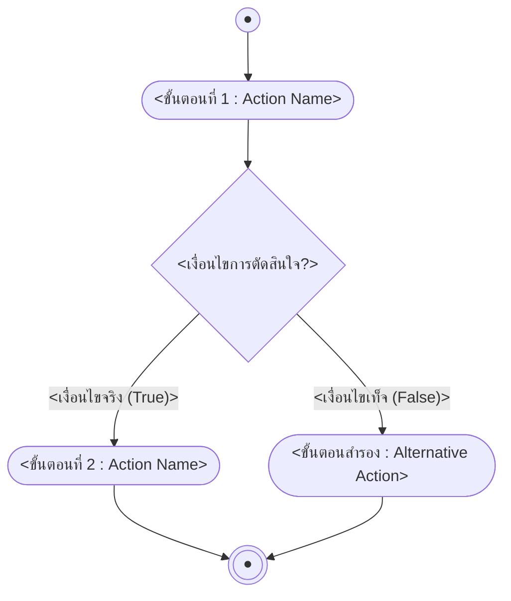

# {{title}}

> [!info] เกี่ยวกับโน้ตนี้
> เอกสารนี้เป็น**งานค้นคว้าหัวข้อที่ได้รับมอบหมาย** (ไม่ได้มาจากสไลด์บรรยายในชั้นเรียน) รวบรวมและสรุปจากแหล่งข้อมูลออนไลน์ที่อ้างอิงไว้ในหัวข้อ link แหล่งอ้างอิง ท้ายเอกสาร

## key Keyword

- **<คำศัพท์/แนวคิดหลัก (English Term)>** — <คำอธิบายสั้น ๆ บรรทัดเดียว>
- **<คำศัพท์/แนวคิดหลัก (English Term)>** — <คำอธิบายสั้น ๆ บรรทัดเดียว>

## menu_book Theory (เข้าใจง่าย)

### 1. <หัวข้อย่อยที่ 1 เช่น ภาพรวม/ประเภท>

<อธิบายเนื้อหาหลักด้วยภาษาที่เข้าใจง่าย ใช้ตาราง/สูตร ($...$)/ตัวอย่างประกอบได้ตามความเหมาะสม>

> [!tip] <หัวข้อเคล็ดลับ/ข้อสังเกต>
> <เนื้อหา>

### 2. <หัวข้อย่อยที่ 2 เช่น หลักการออกแบบวงจร>

<เนื้อหา>

> [!note] เปรียบเทียบกับเนื้อหาที่เรียน
> <เชื่อมโยงหัวข้อค้นคว้ากับเนื้อหา/สัปดาห์ที่เกี่ยวข้องในชั้นเรียน ถ้าเชื่อมโยงได้ — ถ้าไม่เกี่ยวข้องให้ลบ callout นี้ทิ้ง>

<!--
เพิ่ม ### 3., 4., ... ได้ตามจำนวนหัวข้อย่อยที่ค้นคว้ามา
-->

## schema Diagram

<!--
ใช้เกณฑ์ UML Diagram เดียวกับโน้ตรายหัวข้อทั่วไป (ดู Lecture-Note-Template.md และ Note-Format-Guide.md หัวข้อ "กฎมาตรฐานการใช้ Diagram เป็น UML")
*ถ้าหัวข้อค้นคว้าเป็นคำอธิบาย/ตารางเปรียบเทียบล้วน ๆ ไม่มีขั้นตอนหรือโครงสร้างจริง ให้ลบ section นี้ทิ้งทั้งหมด*
-->

## link แหล่งอ้างอิง

- [<ชื่อแหล่งอ้างอิง 1>](<URL>)
- [<ชื่อแหล่งอ้างอิง 2>](<URL>)
