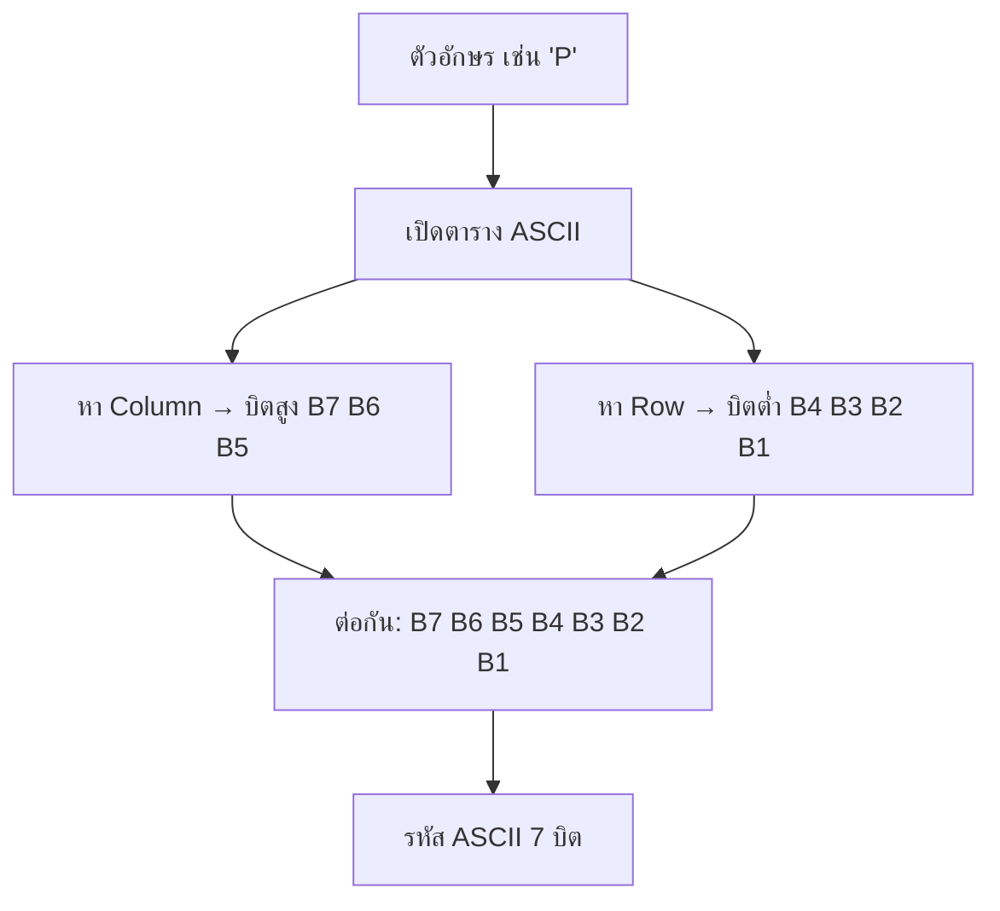

# รหัสแอสกี (ASCII Code)

arrow_back กลับไปที่ [[Week1-MOC|MOC สัปดาห์ 1]] | ก่อนหน้า: [[Error-Detect-Correct]]

## key Keyword

- **ASCII** = American Standard Code for Information Interchange (อ่านว่า "แอสกี")
- รหัสมาตรฐานของอเมริกาใช้แทน**ตัวอักษร ตัวเลข และสัญลักษณ์**สำหรับสื่อสารระหว่างคอมพิวเตอร์กับอุปกรณ์ input/output (คีย์บอร์ด, จอ, เครื่องพิมพ์)
- **ASCII มีขนาด 7 บิต** (ค่าได้ 0-127)
- โครงสร้างตาราง: แบ่งเป็น **Column (บิตสูง 3 บิต)** และ **Row (บิตต่ำ 4 บิต)**

## menu_book Theory (เข้าใจง่าย)

ASCII เป็นแค่ **"ตารางเทียบ"** ระหว่างตัวอักษร 1 ตัว กับรหัสเลขฐานสอง 7 บิต ไม่มีสูตรคำนวณซับซ้อนเหมือนหัวข้อก่อนหน้า — งานหลักคือ**เปิดตารางแล้วอ่านค่า**ให้ถูกแถว/คอลัมน์

**วิธีอ่านตาราง ASCII:**
1. หาว่าตัวอักษรที่ต้องการอยู่ **คอลัมน์ (Col)** ไหน → ได้บิตสูง 3 บิต (B7 B6 B5)
2. หาว่าอยู่ **แถว (Row)** ไหน → ได้บิตต่ำ 4 บิต (B4 B3 B2 B1)
3. เอาบิตสูง + บิตต่ำมาต่อกัน = รหัส ASCII 7 บิตของตัวอักษรนั้น

> [!example] ตัวอักษร 'a'
> อยู่ col=110, row=0001 → รหัส ASCII = `1100001` = $61_{16}$

**ตัวอย่างการแปลงทั้งคำ:** แปลงคำว่า `DIGITAL` เป็น ASCII คือการเปิดตารางทีละตัวอักษรแล้วต่อรหัสกัน:

| D | I | G | I | T | A | L |
|---|---|---|---|---|---|---|
| 1000100 | 1001001 | 1000111 | 1001001 | 1010100 | 1000001 | 1001100 |

> [!tip] จุดสังเกตที่ช่วยจำได้เร็วขึ้น
> - ตัวเลข 0-9 ในตาราง ASCII เรียงกันเป็นชุดต่อเนื่อง (เริ่มที่ 0110000)
> - ตัวอักษรพิมพ์ใหญ่ A-Z เรียงต่อเนื่องกัน, พิมพ์เล็ก a-z ก็เรียงต่อเนื่องกัน (ต่างกับพิมพ์ใหญ่แค่ 1 บิต ตามที่เห็นในตัวอย่าง 'a')
> - อักขระควบคุม (control characters เช่น NUL, TAB, CR, LF) อยู่ช่วงต้นตาราง (0-31) ไม่ใช่ตัวอักษรที่พิมพ์ออกมาเห็นได้

## schema Diagram

---
arrow_back กลับไปที่ [[Week1-MOC|MOC สัปดาห์ 1]] เพื่อดูภาพรวมทั้งหมดอีกครั้ง 🎉
