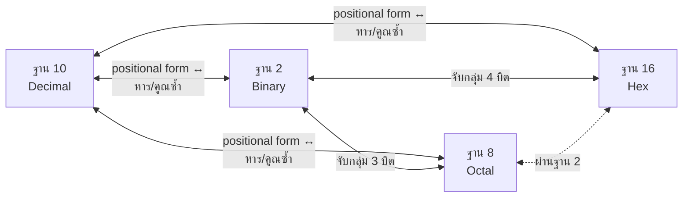
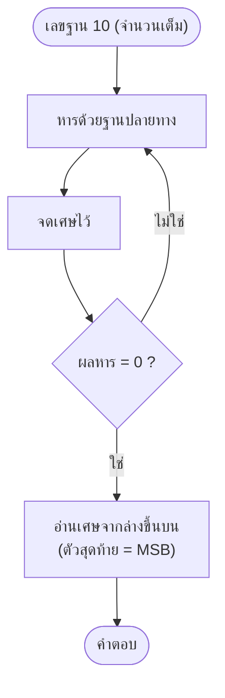
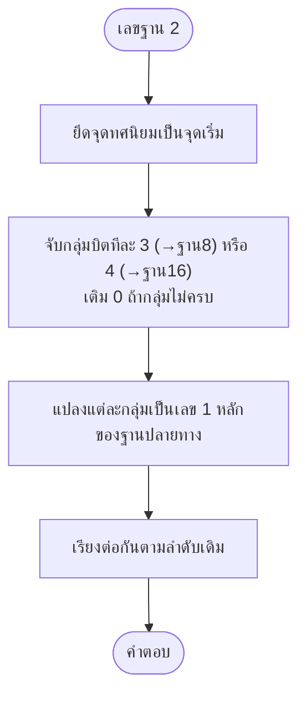

# การแปลงเลขฐาน (Base Conversion)

arrow_back กลับไปที่ [[Week1-MOC|MOC สัปดาห์ 1]] | ก่อนหน้า: [[Number-System-Basics]]

## key Keyword

- **X → 10 (แปลงเป็นฐาน 10)**: ใช้ **Positional Form** (คูณแล้วบวก)
- **10 → X (แปลงจากฐาน 10)**: ใช้ **หารซ้ำ (repeated division)** สำหรับส่วนจำนวนเต็ม, **คูณซ้ำ (repeated multiplication)** สำหรับเศษส่วน
- **2 ↔ 8**: กลุ่มบิตละ **3 บิต** (เพราะ $2^3=8$)
- **2 ↔ 16**: กลุ่มบิตละ **4 บิต** (เพราะ $2^4=16$)
- **8 ↔ 16**: ผ่านฐาน 2 เป็นตัวกลาง (8→2→16 หรือ 16→2→8)

## menu_book Theory (เข้าใจง่าย)

### 1) แปลง "ฐานอะไรก็ได้" → ฐาน 10
ใช้สูตร positional form ตรงๆ (คูณเลขแต่ละหลักด้วยฐานยกกำลังตำแหน่ง แล้วบวกกัน) — ดูตัวอย่างใน [[Number-System-Basics]]

เช่น $(127)_8 = 1\times8^2+2\times8^1+7\times8^0 = 64+16+7=(87)_{10}$

### 2) แปลงฐาน 10 → ฐานอื่น
**ส่วนจำนวนเต็ม:** หารด้วยฐานปลายทางซ้ำๆ จนหารต่อไม่ได้ (ผลลัพธ์เป็น 0) แล้ว**อ่านเศษจากล่างขึ้นบน**เป็นคำตอบ (เศษตัวแรก = LSB, เศษตัวสุดท้าย = MSB)

**ส่วนทศนิยม:** คูณด้วยฐานปลายทางซ้ำๆ แล้ว**อ่านเลขจำนวนเต็มที่ได้จากบนลงล่าง**เป็นคำตอบ (ตัวแรก = MSB)

> [!example] $(12)_{10} = (?)_2$
> 12÷2=6 เศษ0 → 6÷2=3 เศษ0 → 3÷2=1 เศษ1 → 1÷2=0 เศษ1
> อ่านจากล่างขึ้นบน: **1100** ดังนั้น $(12)_{10}=(1100)_2$

> [!example] $(0.125)_{10}=(?)_2$
> 0.125×2=0.25 → เลขจำนวนเต็ม **0**
> 0.25×2=0.5 → **0**
> 0.5×2=1.000 → **1**
> อ่านจากบนลงล่าง: **0.001**

### 3) แปลงระหว่าง 2, 8, 16 (ลัดผ่านการจับกลุ่มบิต)
เพราะ $8=2^3$ และ $16=2^4$ จึงไม่ต้องผ่านฐาน 10 — ใช้การ**จับกลุ่มบิต**แทน:

- **2→8**: จับกลุ่มบิตละ 3 ตัว **นับจากจุดทศนิยมออกไปทั้งสองทาง** (เติม 0 ข้างหน้า/หลังถ้าไม่ครบกลุ่ม) แล้วแปลงแต่ละกลุ่มเป็นเลขฐาน 8 ทีละหลัก
- **2→16**: เหมือนกันแต่จับกลุ่มละ 4 บิต
- **8→2 หรือ 16→2**: กระจายแต่ละหลักกลับเป็นกลุ่มบิต (3 บิตหรือ 4 บิตตามลำดับ) แล้วต่อกัน
- **8↔16**: แปลงผ่านฐาน 2 เป็นตัวกลาง (8→2 แล้ว 2→16, หรือกลับกัน)

> [!example] $(11110001101)_2 = (?)_8$
> จับกลุ่ม 3 บิตจากขวา (เติม 0 ข้างหน้าให้ครบ): `011 110 001 101` → **3615**₈

> [!important] ข้อควรระวัง
> การจับกลุ่มบิตต้องเริ่มนับจาก**จุดทศนิยม**เสมอ ถ้ามีเศษทศนิยม ให้จับกลุ่มขาซ้ายของจุด (เติม 0 ด้านซ้ายสุด) และขาขวาของจุด (เติม 0 ด้านขวาสุด) แยกกัน

## schema Diagram

**แผนที่ความสัมพันธ์ระหว่างฐาน:**

**ขั้นตอนแปลง 10 → ฐานอื่น (ส่วนจำนวนเต็ม):**

**ขั้นตอนแปลง 2 → 8/16 (จับกลุ่มบิต):**

---
arrow_forward ต่อไป: [[Binary-Arithmetic]]
