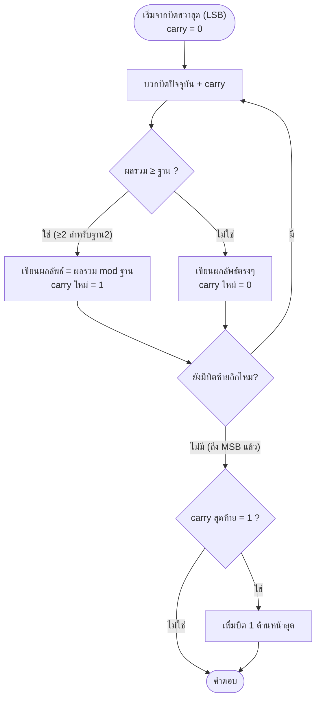

# การบวก/ลบเลขฐานสอง, ฐานแปด, ฐานสิบหก

arrow_back กลับไปที่ [[Week1-MOC|MOC สัปดาห์ 1]] | ก่อนหน้า: [[Base-Conversion]]

## key Keyword

- **ตัวทด (Carry)** — เกิดตอน**บวก**แล้วผลรวมเกินฐาน
- **ตัวยืม (Borrow)** — เกิดตอน**ลบ**แล้วตัวตั้งน้อยกว่าตัวลบ
- หลักการ**เหมือนเลขฐาน 10 ทุกอย่าง** ต่างแค่ "ค่าที่ทด/ยืมครั้งละเท่าไหร่" (ฐาน 2 = ทด/ยืมครั้งละ 2, ฐาน 8 = ครั้งละ 8, ฐาน 16 = ครั้งละ 16)

## menu_book Theory (เข้าใจง่าย)

การบวกลบเลขฐานสองมีกฎ 4 แบบ (ตามตารางค่าตัวตั้ง+ตัวบวก):

| ตัวตั้ง | ตัวบวก | ผลลัพธ์ | ตัวทด |
| ------- | ------ | ------- | ----- |
| 0       | 0      | 0       | 0     |
| 0       | 1      | 1       | 0     |
| 1       | 0      | 1       | 0     |
| 1       | 1      | 0       | **1** |

การลบก็มีกฎคล้ายกันแต่คิดเรื่อง**ตัวยืม**แทน (เช่น `0 - 1 = 1` แต่ต้องยืม 1 จากหลักถัดไป)

**แนวคิดสำคัญ:** ไม่ว่าฐานไหน วิธีทำเหมือนการบวก/ลบเลขฐาน 10 ที่เราคุ้นเคย เพียงแต่:
- ฐาน 2: พอผลรวม ≥ 2 ให้ทด 1 ไปหลักถัดไป
- ฐาน 8: พอผลรวม ≥ 8 ให้ทด 1 (เช่น $4613_8+3207_8$: หลักขวาสุด $3+7=10_{10}=12_8$ → เขียน 2 ทด 1)
- ฐาน 16: พอผลรวม ≥ 16 ให้ทด 1 (ใช้ A-F แทนเลข 10-15 เหมือนเดิม)

> [!tip] เคล็ดลับ
> ถ้าไม่ชัวร์ ให้แปลงแต่ละหลัก (digit) เป็นฐาน 10 ก่อน บวก/ลบแบบฐาน 10 ตามปกติ แล้วค่อยแปลงผลลัพธ์กลับเป็นฐานเดิม — ใช้เช็คคำตอบได้ดี

## schema Diagram

**กระบวนการบวกเลขฐานสอง (bit-by-bit จาก LSB → MSB):**

**ตัวอย่าง:** $10011_2 + 10100_2 = 100111_2$ (19+20=39 ตรวจสอบด้วยฐาน 10 ได้ — ดูรายละเอียดบนสไลด์หน้า 35)

---
arrow_forward ต่อไป: [[Complements]]
