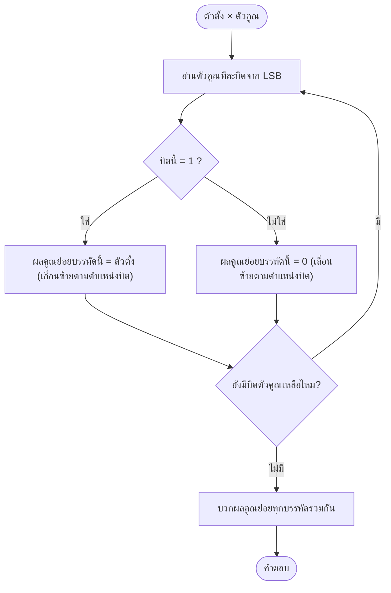
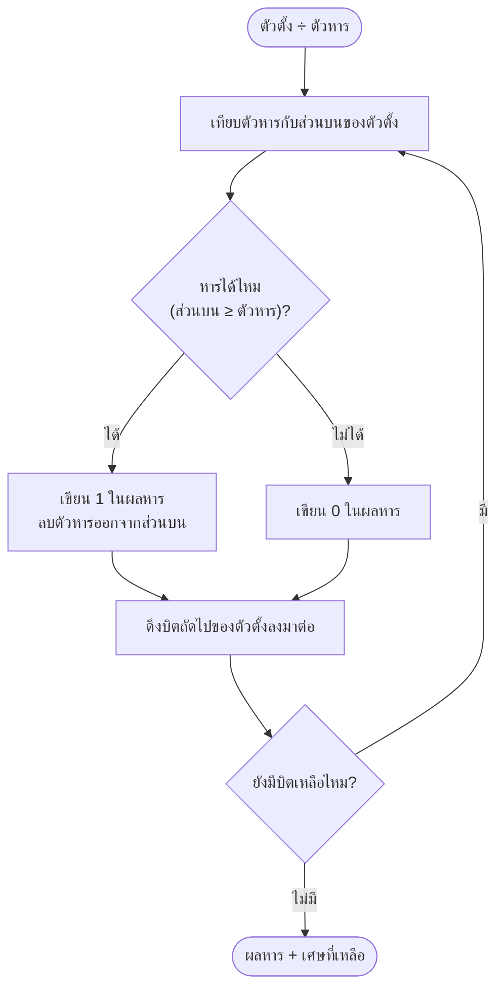

# การคูณ/หารเลขฐานสอง

arrow_back กลับไปที่ [[Week1-MOC|MOC สัปดาห์ 1]] | ก่อนหน้า: [[Complements]]

## key Keyword

- ใช้**หลักการเดียวกับเลขฐานสิบ** เพียงแต่มีแค่ 2 เลข (0,1)
- **การคูณ** = shift + add (เลื่อนบิตแล้วบวก)
- **การหาร** = long division แบบเดียวกับฐาน 10

## menu_book Theory (เข้าใจง่าย)

**การคูณเลขฐานสอง:** ตารางคูณมีแค่ 4 กรณี (ง่ายกว่าฐาน 10 มาก)

| A | B | A×B |
|---|---|---|
| 0 | 0 | 0 |
| 0 | 1 | 0 |
| 1 | 0 | 0 |
| 1 | 1 | 1 |

วิธีทำ: คูณตัวตั้งด้วยแต่ละบิตของตัวคูณทีละบิต (ได้ผลคูณย่อย = ตัวตั้งเดิม หรือ 0 ทั้งหมด) แล้ว**เลื่อนตำแหน่ง (shift)** ไปทางซ้ายทีละ 1 ตำแหน่งในแต่ละบรรทัดเหมือนคูณเลขฐาน 10 จากนั้นนำผลคูณย่อยทั้งหมดมา**บวกกัน** (ใช้กติกาบวกเลขฐานสองจาก [[Binary-Arithmetic]])

**การหารเลขฐานสอง:** ใช้วิธี long division เหมือนฐาน 10 ทุกขั้นตอน คือ เทียบตัวหารกับตัวตั้งบางส่วน ถ้าหารได้ (ตัวตั้งบางส่วน ≥ ตัวหาร) ใส่ 1 แล้วลบออก ถ้าหารไม่ได้ใส่ 0 แล้วดึงบิตถัดไปลงมา ทำซ้ำจนครบ

## schema Diagram

**การคูณ (shift-and-add):**

**การหาร (long division):**

---
arrow_forward ต่อไป: [[Codes-BCD]]
