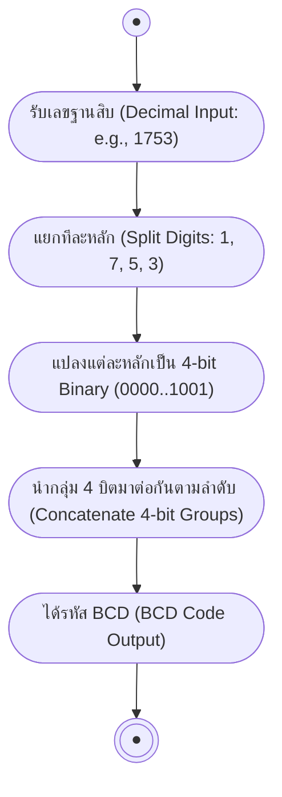
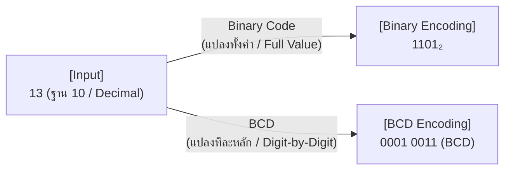

# รหัสในระบบดิจิทัล: Binary Code & BCD-8421

arrow_back กลับไปที่ [[Week1-MOC|MOC สัปดาห์ 1]] | ก่อนหน้า: [[Binary-Multiply-Divide]]

## key Keyword

- **Code (รหัส)** — การจับชุดเลขฐานสองมาเป็นกลุ่ม เพื่อใช้แทนตัวเลข/อักขระ/สัญลักษณ์
- **Binary Code** — การเขียนเลขฐานสองแทนเลขฐานสิบ โดย**แปลงฐานตรงๆ** (ทั้งค่า ไม่ใช่ทีละหลัก)
- **BCD (Binary Coded Decimal) - 8421** — เขียนเลขฐานสองแทนเลขฐานสิบ **ทีละหลัก** หลักละ 4 บิต (**ไม่ใช่การแปลงฐานทั้งค่า**)
- **น้ำหนักบิต 8-4-2-1** — ชื่อ BCD-8421 มาจากน้ำหนักของแต่ละบิตในกลุ่ม 4 บิต ($2^3,2^2,2^1,2^0$)
- **Invalid/Forbidden codes** — รหัส 1010, 1011, 1100, 1101, 1110, 1111 **ไม่ถูกใช้**ใน BCD (เพราะเกิน 9)

## menu_book Theory (เข้าใจง่าย)

จุดที่**สับสนบ่อยที่สุด**ของหัวข้อนี้คือ **Binary Code ≠ BCD** ทั้งที่หน้าตาคล้ายกัน:

- **Binary Code**: แปลง**ทั้งค่า**จากฐาน 10 เป็นฐาน 2 (ใช้วิธีหารซ้ำจาก [[Base-Conversion]]) เช่น $13.6875_{10} = 1101.1011_2$
- **BCD**: แปลง**ทีละหลัก** โดยแต่ละหลักของเลขฐาน 10 แทนด้วยเลขฐาน 2 จำนวน 4 บิต เช่น $1753_{10}$ → 1=`0001`, 7=`0111`, 5=`0101`, 3=`0011` → BCD = `0001 0111 0101 0011` (**ไม่เท่ากับ** การแปลง 1753 เป็นฐานสองทั้งค่า!)

> [!important] ทำไมต้องมี BCD ทั้งที่ยาวกว่า Binary Code?
> BCD แปลงกลับไปแสดงผลเป็นเลขฐาน 10 ได้ง่ายและตรงไปตรงมา (เหมาะกับจอแสดงผลตัวเลข เครื่องคิดเลข นาฬิกาดิจิทัล) เพราะแต่ละหลักอิสระจากกัน ไม่ต้องคำนวณแปลงฐานใหม่ทั้งก้อน

**เลขฐานแปด/สิบหกใน BCD:** ตารางเทียบ "รหัส BCD ↔ เลขฐานแปด ↔ เลขฐานสิบหก" ใช้หลักเดียวกัน (4 บิตแทน 1 หลักฐานสิบ) แต่เมื่อค่าเกิน 9 (คือ A-F ในฐาน 16) จะไม่มีในตาราง BCD เพราะ BCD ออกแบบมาแทนฐาน 10 เท่านั้น

## schema Diagram

**กระบวนการเข้ารหัส BCD (BCD Encoding Activity Diagram):**

**เทียบความต่าง Binary Code vs BCD (Encoding Comparison Diagram):**

---
arrow_forward ต่อไป: [[Excess3-Gray-Code]]
