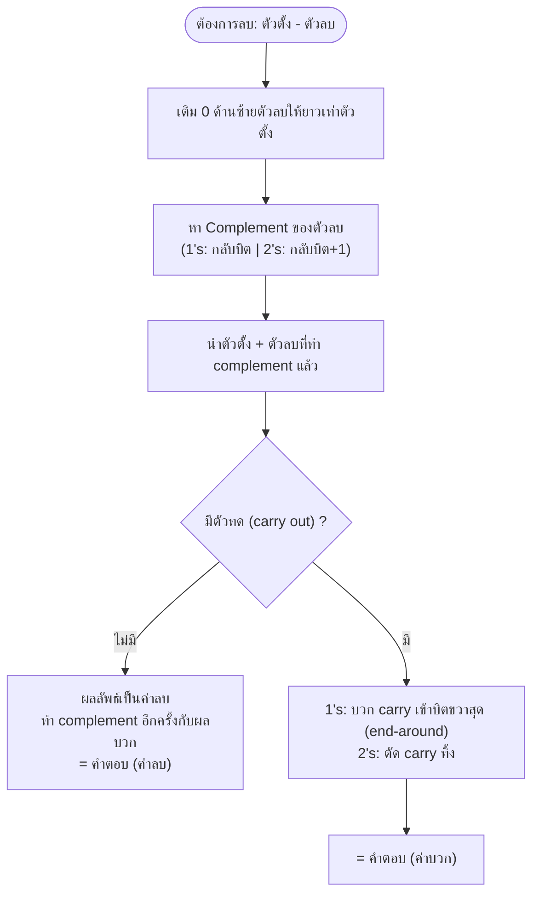

# คอมพลีเมนต์ (Complement)

⬅️ กลับไปที่ [[Week1-MOC|MOC สัปดาห์ 1]] | ก่อนหน้า: [[Binary-Arithmetic]]

## 🔑 Keyword

- **คอมพลีเมนต์ (Complement) / ส่วนเติมเต็ม** — เทคนิคทำให้ "การลบ" กลายเป็น "การบวก" (วงจรดิจิทัลออกแบบมาให้บวกได้ง่ายกว่าลบ)
- **(b-1)'s Complement** — ฐานสิบ = **9's Complement**, ฐานสอง = **1's Complement**
- **(b)'s Complement** — ฐานสิบ = **10's Complement**, ฐานสอง = **2's Complement**
- **1's Complement** = กลับบิต (0↔1) ทุกตัว
- **2's Complement** = 1's Complement + 1

## 📖 Theory (เข้าใจง่าย)

**ทำไมต้องมีคอมพลีเมนต์?** เพราะวงจรฮาร์ดแวร์ทำวงจร "บวก" ได้ง่ายกว่าวงจร "ลบ" มาก วิศวกรจึงคิดวิธีเปลี่ยนโจทย์ลบให้กลายเป็นโจทย์บวกแทน โดยใช้คอมพลีเมนต์ของตัวลบ

### 9's / 10's Complement (ฐานสิบ — ใช้อธิบายแนวคิด)
- **9's Complement** = เอา 9 ซ้ำๆ (เลขสูงสุดของฐาน 10) ลบด้วยตัวเลขนั้น เช่น 9's ของ 426197 = 999999-426197 = **573802**
- **10's Complement** = 9's Complement + 1 = **573803**

### 1's / 2's Complement (ฐานสอง — ใช้จริงในดิจิทัล)
- **1's Complement** = กลับบิตทุกตัว (0→1, 1→0) — เทียบเท่า 9's complement ของฐาน 2
- **2's Complement** = 1's Complement + 1 — เทียบเท่า 10's complement ของฐาน 2

### วิธีลบเลขด้วย 1's Complement
1. ถ้าบิตตัวลบน้อยกว่าตัวตั้ง ให้เติม 0 ด้านซ้ายจนความยาวเท่ากัน แล้วหา **1's complement ของตัวลบ**
2. นำตัวตั้งมา**บวก**กับตัวลบที่ทำ 1's complement แล้ว
3. ดูผลบวก:
   - **ไม่มีตัวทด** → ผลลัพธ์เป็น**ลบ** ต้องนำผลบวกไปทำ 1's complement อีกครั้งเพื่อได้คำตอบจริง
   - **มีตัวทด** → นำตัวทดไปบวกเข้ากับบิตขวาสุดอีกครั้ง (เรียกว่า **end-around carry**) ผลลัพธ์ที่ได้คือคำตอบและเป็น**บวก**

### วิธีลบเลขด้วย 2's Complement (นิยมใช้กว่า เพราะไม่ต้องมี end-around carry)
1. หา **2's complement ของตัวลบ**
2. นำตัวตั้งมา**บวก**กับตัวลบที่ทำ 2's complement แล้ว
3. ดูผลบวก:
   - **ไม่มีตัวทด** → ผลลัพธ์เป็น**ลบ** ต้องนำผลบวกไปทำ 2's complement อีกครั้ง
   - **มีตัวทด** → **ตัดตัวทดทิ้ง** ผลลัพธ์ที่เหลือคือคำตอบและเป็น**บวก**

> [!important] ความต่างสำคัญระหว่าง 1's กับ 2's
> 1's complement: มีตัวทด → ต้อง**บวกเพิ่ม** (end-around carry) | 2's complement: มีตัวทด → **ตัดทิ้งเลย** ง่ายกว่า จึงเป็นที่นิยมในฮาร์ดแวร์จริง

## 🖼️ Diagram

---
➡️ ต่อไป: [[Binary-Multiply-Divide]]
