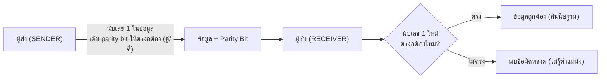
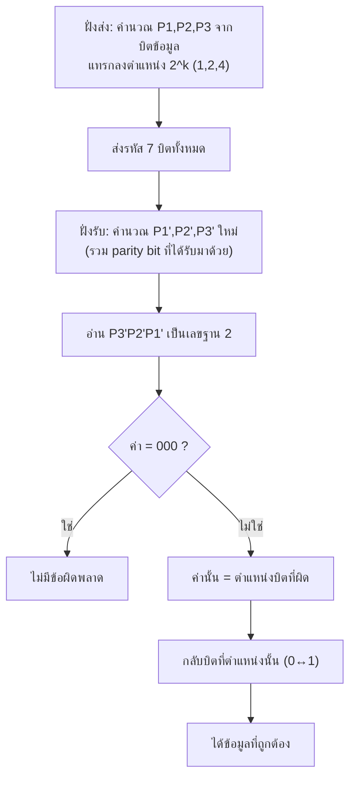

# รหัสตรวจสอบ/แก้ไขความผิดพลาด (Parity & Hamming Code)

arrow_back กลับไปที่ [[Week1-MOC|MOC สัปดาห์ 1]] | ก่อนหน้า: [[Excess3-Gray-Code]]

## key Keyword

- **Parity Bit (พาริตี้บิต)** — บิตพิเศษที่เติมเข้าไปเพื่อ**ตรวจสอบ**ว่าข้อมูลผิดพลาดหรือไม่ (ตรวจได้อย่างเดียว แก้ไม่ได้)
- **Even Parity (พาริตี้คู่)** — เติมบิตให้จำนวนเลข 1 ทั้งหมด**เป็นคู่**
- **Odd Parity (พาริตี้คี่)** — เติมบิตให้จำนวนเลข 1 ทั้งหมด**เป็นคี่**
- **Hamming Code (รหัสแฮมมิ่ง)** — รหัสที่ **ตรวจสอบและแก้ไข**ความผิดพลาดได้ด้วย โดยเพิ่มพาริตี้บิตหลายตัว ($P_1, P_2, P_3, ...$)
- **สูตรจำนวนพาริตี้บิต:** $n \le (2^P - P - 1)$ เมื่อ `n` = จำนวนบิตข้อมูล, `P` = จำนวนบิตพาริตี้ที่ต้องใช้

## menu_book Theory (เข้าใจง่าย)

### Parity — ตรวจได้ แก้ไม่ได้
หลักการง่ายๆ: **นับจำนวนเลข 1** ในข้อมูล แล้วเติมพาริตี้บิต 1 ตัวให้ผลรวมเลข 1 (รวมพาริตี้บิต) เป็น**คู่** (even) หรือ**คี่** (odd) ตามที่ตกลงกันไว้ล่วงหน้าระหว่างผู้ส่ง-ผู้รับ ผู้รับเช็คแค่ว่านับ 1 แล้วตรงกับกติกาไหม ถ้าไม่ตรง = มีข้อมูลผิดพลาด (แต่**บอกไม่ได้ว่าผิดที่บิตไหน**)

### Hamming Code — ตรวจได้ + บอกตำแหน่งที่ผิด + แก้ได้
แนวคิด: ใช้พาริตี้บิตหลายตัว โดยแต่ละตัว**คุม (cover) เฉพาะบางบิตข้อมูล** ที่ไม่ซ้ำกันในลักษณะเฉพาะ (ตำแหน่งบิตที่เป็นเลขยกกำลัง 2: 1,2,4,8,...) เมื่อผู้รับคำนวณพาริตี้ใหม่ ($P_1', P_2', P_3'$) แล้วนำมาต่อกันเป็นเลขฐาน 2 จะได้**ตำแหน่งบิตที่ผิดพลาดพอดี** (0 = ไม่ผิด)

**ตัวอย่างจากสไลด์ (ข้อมูล 4 บิต, ใช้พาริตี้ 3 บิต รวม 7 บิต):**

| ตำแหน่ง | $n_7$ | $n_6$ | $n_5$ | $n_4$ | $n_3$ | $n_2$ | $n_1$ |
|---|---|---|---|---|---|---|---|
| ข้อมูล | $m_4$ | $m_3$ | $m_2$ | $P_3$ | $m_1$ | $P_2$ | $P_1$ |

สูตรคำนวณพาริตี้ (แต่ละตัวคุมกลุ่มบิตข้อมูลต่างกัน):
- $P_1 = m_1 \oplus m_2 \oplus m_4$
- $P_2 = m_1 \oplus m_3 \oplus m_4$
- $P_3 = m_2 \oplus m_3 \oplus m_4$

**ตอนตรวจสอบ (ฝั่งรับ):** คำนวณ $P_1', P_2', P_3'$ ด้วยสูตรเดียวกัน (รวม parity bit เดิมเข้าไปด้วย) แล้วนำ $P_3'P_2'P_1'$ มาอ่านเป็นเลขฐาน 2 → **ถ้า = 000 แปลว่าไม่ผิด**, ถ้าไม่ใช่ 000 ค่านั้นคือ**ตำแหน่งบิตที่ผิด** (ให้กลับบิตนั้นเพื่อแก้ไข)

> [!example] จากสไลด์: Hamming code `1000110` → $P_3'P_2'P_1' = 110 = 6$ → บิตที่ 6 ($n_6=m_3$) ผิด → ค่าที่ถูกต้องคือ `1100110`

## schema Diagram

**Parity (ตรวจอย่างเดียว):**

**Hamming Code (ตรวจ + แก้ได้):**

---
arrow_forward ต่อไป: [[ASCII-Code]]
