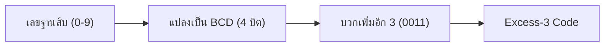
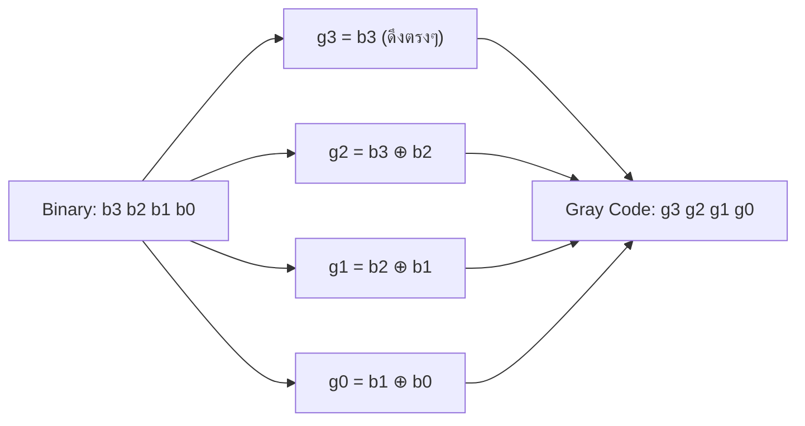
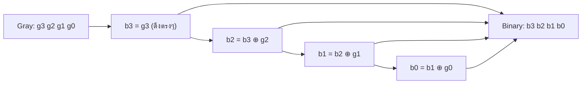

# รหัสเกิน 3 (Excess-3) และ รหัสเกรย์ (Gray Code)

⬅️ กลับไปที่ [[Week1-MOC|MOC สัปดาห์ 1]] | ก่อนหน้า: [[Codes-BCD]]

## 🔑 Keyword

- **Excess-3 Code (รหัสเกิน 3)** = **BCD + 3** (บวกเพิ่มอีก 3 เสมอ)
- **Self-complementing code** — คุณสมบัติพิเศษของ Excess-3 ที่ช่วยให้วงจรลบง่ายขึ้น (กล่าวถึงในสไลด์)
- **Gray Code (รหัสเกรย์)** — รหัสที่**เปลี่ยนแปลงแค่ 1 บิต**เมื่อค่าเพิ่ม/ลด 1 (ไม่มีน้ำหนักในตัว = unweighted code)
- ใช้ Gray Code ในระบบ**ควบคุมกลไกเชิงแกนหมุน** (เพราะลดโอกาสอ่านค่าผิดพลาดตอนเปลี่ยนค่า)
- **XOR (⊕)** — ตัวดำเนินการหลักที่ใช้แปลง Binary ↔ Gray

## 📖 Theory (เข้าใจง่าย)

### Excess-3 Code
ง่ายมาก: เอารหัส **BCD บวกเพิ่มอีก 3** (ทุกหลัก) เช่น เลข 9 → BCD คือ `1001` → Excess-3 คือ `1001+0011=1100`

> [!example]
> Decimal 3,5,9 → Excess-3 คือ 0110, 1000, 1100 (คือ BCD ของ 3,5,9 บวก 3 ทุกตัว)

### Gray Code
**ปัญหาที่ Gray Code แก้:** เลขฐานสองปกติ เวลาค่าเปลี่ยนจาก 3→4 (`011`→`100`) เปลี่ยนพร้อมกันถึง 3 บิต ถ้าวงจรอ่านค่าตอนบิตเปลี่ยนไม่พร้อมกันเป๊ะ (เป็นไปไม่ได้ในความเป็นจริง) อาจอ่านค่ากลางๆ ผิดเพี้ยนไปไกลมาก — Gray code ออกแบบให้**เปลี่ยนทีละ 1 บิตเท่านั้น** ไม่ว่าค่าจะขยับกี่ก็ตาม จึงปลอดภัยกว่าเวลาใช้วัดตำแหน่ง/มุมหมุนจริง

**วิธีแปลง Binary → Gray:**
1. เขียนบิต Binary เรียงกัน
2. ดึงบิตซ้ายสุด (MSB) ลงมาตรงๆ เป็นบิตซ้ายสุดของ Gray
3. นำแต่ละบิตมา **XOR** กับบิตถัดไปทางขวา (บิตปัจจุบัน ⊕ บิตขวาถัดไป) ได้บิต Gray ตัวถัดไป ทำซ้ำจนครบ

**วิธีแปลง Gray → Binary (ย้อนกลับ):**
1. ดึง MSB ของ Gray ลงมาตรงๆ เป็น MSB ของ Binary
2. นำบิต **Binary ที่เพิ่งได้** มา XOR กับบิต Gray ตัวถัดไป ได้บิต Binary ตัวถัดไป ทำซ้ำไปเรื่อยๆ จนถึง LSB

> [!important] จุดต่างสำคัญของทั้งสองทิศทาง
> ขาไป (Binary→Gray) ใช้บิต **Binary เดิม** สองตัวติดกัน XOR กัน | ขากลับ (Gray→Binary) ใช้บิต **Binary ที่เพิ่งคำนวณได้ใหม่** ไป XOR กับ Gray ตัวถัดไป (เป็นการ "พก" ผลลัพธ์ไปเรื่อยๆ)

## 🖼️ Diagram

**Excess-3:**

**Binary → Gray:**

**Gray → Binary:**

---
➡️ ต่อไป: [[Error-Detect-Correct]]
