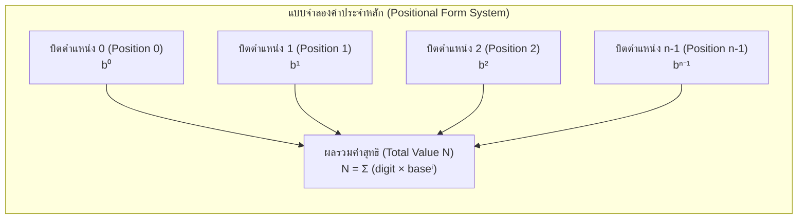
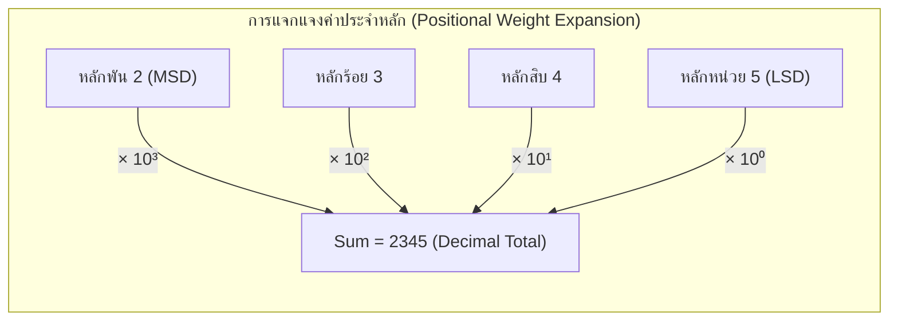

# ระบบเลขฐาน (Number System) — พื้นฐาน

arrow_back กลับไปที่ [[Week1-MOC|MOC สัปดาห์ 1]] | ก่อนหน้า: [[Course-Intro]]

## key Keyword

- **Number System / ระบบจำนวน** — วิธีเขียนแทนตัวเลขด้วยชุดสัญลักษณ์ (symbols) ชุดหนึ่ง
- **Base / Radix (ฐาน)** — จำนวนสัญลักษณ์ที่ใช้ในระบบนั้น
- **Decimal (ฐาน 10)** — `{0-9}` → มนุษย์ใช้
- **Binary (ฐาน 2)** — `{0,1}` → คอมพิวเตอร์ใช้
- **Octal (ฐาน 8)** — `{0-7}`
- **Hexadecimal (ฐาน 16)** — `{0-9, A-F}`
- **Positional Form / Polynomial Form** — ค่าของแต่ละหลักขึ้นกับ "ตำแหน่ง" (position)
- **MSD (Most Significant Digit)** — หลักซ้ายสุด, ค่ามากที่สุด
- **LSD (Least Significant Digit)** — หลักขวาสุด, ค่าน้อยที่สุด
- **MSB / LSB** — เหมือน MSD/LSD แต่ใช้เรียกในระบบฐานสอง (Bit)

## menu_book Theory (เข้าใจง่าย)

ทุกระบบเลขฐานใช้หลักการเดียวกัน: **ค่าของตัวเลข = ผลรวมของ (หลัก × ฐานยกกำลังตำแหน่ง)**

$$N_b = a_{n-1}a_{n-2}\dots a_1a_0 . a_{-1}a_{-2}\dots a_{-m}$$

$$N = \sum a_i \times b^{i}$$

โดย `b` คือฐาน, ตำแหน่งซ้ายของจุดทศนิยมเริ่มนับจาก `0,1,2,...` (ยิ่งซ้ายยิ่งเลขชี้กำลังสูง) ส่วนขวาของจุดทศนิยมเป็นเลขชี้กำลังติดลบ `-1,-2,...`

**ตัวอย่างที่ทุกคนคุ้นเคย (ฐาน 10):**
$$2345 = 2\times10^3 + 3\times10^2 + 4\times10^1 + 5\times10^0$$

**หลักการเดียวกันนี้ใช้ได้กับทุกฐาน** เช่น ฐานสอง:
$$(1010.11)_2 = 1\times2^3+0\times2^2+1\times2^1+0\times2^0+1\times2^{-1}+1\times2^{-2} = (10.75)_{10}$$

> [!tip] จำง่ายๆ
> มนุษย์ใช้ฐาน 10 เพราะมี 10 นิ้ว, คอมพิวเตอร์ใช้ฐาน 2 เพราะวงจรไฟฟ้ามีแค่ 2 สถานะ (มี/ไม่มีกระแส → 1/0) ส่วนฐาน 8 และ 16 เป็น "ทางลัด" ในการเขียนเลขฐานสองยาวๆ ให้สั้นลง (จะเห็นชัดใน [[Base-Conversion]])

**ตารางเทียบฐาน (ต้องคุ้นตา ใช้บ่อยมาก):**

| Decimal | Binary | Octal | Hex |
|---|---|---|---|
| 0 | 0000 | 0 | 0 |
| 1 | 0001 | 1 | 1 |
| 2 | 0010 | 2 | 2 |
| ... | ... | ... | ... |
| 8 | 1000 | 10 | 8 |
| 15 | 1111 | 17 | F |
| 16 | 10000 | 20 | 10 |

**Powers ที่ควรจำขึ้นใจ:** $2^0..2^{10}$ = 1,2,4,8,16,32,64,128,256,512,1024 | $8^0..8^3$ = 1,8,64,512 | $16^0..16^3$ = 1,16,256,4096

## schema Diagram

**แนวคิดแบบจำลองค่าประจำหลัก (Positional Form System Diagram):**

**ตัวอย่างการแจกแจงค่าประจำหลักของเลข 2345 (Positional Weight Expansion):**

---
arrow_forward ต่อไป: [[Base-Conversion]]
