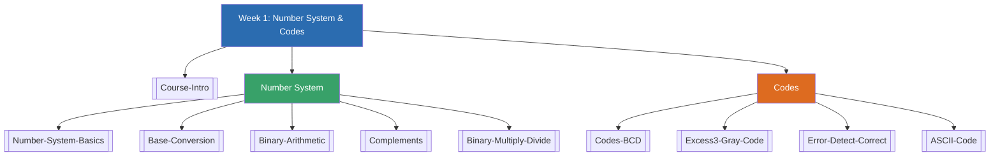

# Week 1 — Number System & Codes (MOC)

> [!info] ตารางเรียน
> คาบเรียนสัปดาห์ 1: **09:30-12:30 และ 14:00-17:00** (รวม 6 ชม./สัปดาห์) — Electronic & Digital Lab (C)
> ช่วง 07/09/69 - 15/11/69 (2026-09-07 ถึง 2026-11-15)

## ✅ เช็คลิสต์ก่อนเข้าเรียน

- [ ] ทบทวนสูตร positional form: $N_b = a_{n-1}b^{n-1} + \dots + a_0b^0 + a_{-1}b^{-1} + \dots$
- [ ] ท่องจำ/คุ้นเคยกับ powers of 2 ($2^0$–$2^{10}$), powers of 8, powers of 16 (ดู [[Number-System-Basics]])
- [ ] ลองแปลงเลขฐานด้วยมือ (ห้ามใช้เครื่องคิดเลข) สัก 2-3 ข้อ ทั้งขาไป (X→10) และขากลับ (10→X) — ดู [[Base-Conversion]]
- [ ] ทบทวนวิธีบวก/ลบเลขฐานสองแบบมีทด/ยืม (carry/borrow) — [[Binary-Arithmetic]]
- [ ] เข้าใจแนวคิดคอมพลีเมนต์คร่าวๆ ว่าใช้ "บวก" แทน "ลบ" ได้อย่างไร — [[Complements]]
- [ ] รู้จักชื่อ-ความหมายคร่าวๆ ของ BCD, Excess-3, Gray Code, Parity, Hamming Code, ASCII
- [ ] เตรียมสมุด/ปากกา สำหรับฝึกโจทย์ในคาบ (สไลด์มีแบบฝึกหัดให้ทำสดในคาบ เช่น หน้า 34 ให้เวลา 15 นาทีห้ามใช้เครื่องคิดเลข)
- [ ] เข้า PIM e-Learning เช็คเอกสารประกอบการสอน/ประกาศล่วงหน้า

## 📋 ภาพรวมคาบปฐมนิเทศ (สรุปย่อ — รายละเอียดเต็มดูที่ [[Course-Intro]])

- **อาจารย์ผู้สอน:** ผศ.ดร. ติณณภพ ดินดำ
- **คำอธิบายรายวิชา:** ระบบตัวเลขและรหัส, พีชคณิตบูลีนและลอจิกเกต, แผนผังคาร์โนห์, วงจรคอมบิเนชัน, วงจรเข้ารหัส/ถอดรหัส, ฟลิปฟล็อป, วงจรเชิงลำดับ, ชิฟต์รีจิสเตอร์และหน่วยความจำ, การออกแบบวงจรลอจิกด้วย VHDL/Verilog, สถาปัตยกรรมคอมพิวเตอร์เบื้องต้น
- **เกณฑ์ให้คะแนน:** เข้าเรียน/ตรงเวลา 10, ค้นคว้าหัวข้อที่มอบหมายเอง+การบ้าน 15, สอบกลางภาค 30, สอบปฏิบัติ (Final test) 15, สอบปลายภาค 30
- **เกรด:** A ≥80, B+ 75-79, B 70-74, C+ 65-69, C 50-64, D+ 45-49, D 40-44, F <40
- **ช่องทางเรียน:** PIM e-Learning
- เอกสารอ้างอิงหลักที่อาจารย์ใช้: เอกสารประกอบการสอน 040613112 Digital Circuit Design (อ.เอิญ สุริยะฉาย, KMUTNB) และเอกสารจาก ม.เทคโนโลยีมหานคร, ราชมงคลอีสาน

## 🗺️ แผนที่หัวข้อสัปดาห์ 1

## 📚 โน้ตรายหัวข้อ

| หัวข้อ | เนื้อหาหลัก | หน้าสไลด์ |
|---|---|---|
| [[Course-Intro]] | อาจารย์ผู้สอน, คำอธิบายรายวิชา, เกณฑ์ให้คะแนน | 1-8 |
| [[Number-System-Basics]] | Decimal/Binary/Octal/Hex, Positional Form | 9-16 |
| [[Base-Conversion]] | แปลงฐาน 10↔2,8,16 และ 2↔8↔16 | 17-34 |
| [[Binary-Arithmetic]] | บวก/ลบเลขฐาน 2, 8, 16 | 35-40 |
| [[Complements]] | (b-1)'s / b's Complement, การลบด้วยคอมพลีเมนต์ | 41-49 |
| [[Binary-Multiply-Divide]] | คูณ/หารเลขฐานสอง | 50-52 |
| [[Codes-BCD]] | Binary Code, BCD-8421 | 53-58 |
| [[Excess3-Gray-Code]] | รหัสเกิน 3, รหัสเกรย์ | 59-63 |
| [[Error-Detect-Correct]] | Parity, Hamming Code | 64-69 |
| [[ASCII-Code]] | รหัสแอสกี | 70-75 |

> [!tip] สัปดาห์หน้า (แอบดูล่วงหน้า)
> ท้ายสไลด์ (หน้า 75) เกริ่นถึง IC เกตพื้นฐาน (74HC04 = Inverter, 74HC32 = OR gate) ซึ่งเป็นหัวข้อถัดไป "ไอซี และ ลอจิกเกต" — ยังไม่ต้องอ่านลึกตอนนี้ แค่รู้ไว้ว่าเป็นเนื้อหาต่อยอด

➡️ สัปดาห์ถัดไป: [[Week2-MOC|MOC สัปดาห์ 2]]
