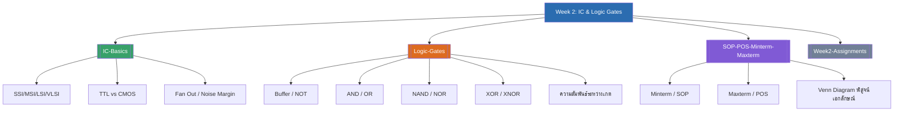

# Week 2 — IC & Logic Gates (MOC)

arrow_back สัปดาห์ก่อนหน้า: [[Week1-MOC|MOC สัปดาห์ 1]]

## check_circle เช็คลิสต์ก่อนเข้าเรียน

- [ ] ทบทวนความหมาย HIGH/LOW และ Positive/Negative Logic — ดู [[Logic-Gates]]
- [ ] จำสัญลักษณ์เกตพื้นฐานทั้ง 8 ตัวให้ได้ (Buffer, NOT, AND, OR, NAND, NOR, XOR, XNOR) พร้อมสมการและตารางความจริง
- [ ] เข้าใจความแตกต่าง TTL vs CMOS คร่าวๆ (ความเร็ว, กำลังไฟฟ้า, แรงดันเลี้ยง) — ดู [[IC-Basics]]
- [ ] ฝึกเขียนวงจรลอจิกจากสมการบูลีน (จากสัปดาห์ก่อนที่ทบทวน Complement/Boolean มา)
- [ ] ทบทวนวิธีเขียนสมการจากตารางความจริงทั้ง 2 แบบ คือ Minterm (SOP) และ Maxterm (POS) — ดู [[SOP-POS-Minterm-Maxterm]]
- [ ] ลองทำแบบฝึกหัด Assignment 2.1 ล่วงหน้า (เขียนวงจรจากสมการ) — ดู [[Week2-Assignments]]

## assignment ภาพรวมสัปดาห์ 2 (สรุปย่อ)

หัวข้อหลักของสัปดาห์นี้ต่อยอดจากท้ายสไลด์สัปดาห์ 1 (IC เกต 74HC04/74HC32) เข้าสู่เนื้อหา **ไอซีดิจิตอลและลอจิกเกต** อย่างเต็มรูปแบบ ครอบคลุม 3 ส่วนหลัก:

1. **โครงสร้างไอซี** — SSI/MSI/LSI/VLSI และความแตกต่าง TTL vs CMOS
2. **ลอจิกเกตพื้นฐาน 8 ตัว** — Buffer, NOT, AND, OR, NAND, NOR, XOR, XNOR พร้อมสมการบูลีนและตารางความจริง
3. **การแปลงตารางความจริงเป็นสมการ** — Minterm/Sum of Product (SOP) และ Maxterm/Product of Sum (POS) พร้อมการพิสูจน์ด้วยเวนไดอะแกรม

## map แผนที่หัวข้อสัปดาห์ 2

## collections_bookmark โน้ตรายหัวข้อ

| หัวข้อ | เนื้อหาหลัก | หน้าสไลด์ |
|---|---|---|
| [[IC-Basics]] | Analog vs Digital, IC (SSI/MSI/LSI/VLSI), TTL vs CMOS, Fan Out, Noise Margin | 1-8 |
| [[Logic-Gates]] | เครื่องหมายสมการลอจิก, Truth Table, เกตพื้นฐาน 8 ตัว, ความสัมพันธ์ระหว่างเกต, ตัวอย่างวิเคราะห์วงจร | 9-21, 26 |
| [[SOP-POS-Minterm-Maxterm]] | Minterm/SOP, Maxterm/POS, Venn Diagram | 27-40 |
| [[Week2-Assignments]] | Assignment 2.1 (สมการ→วงจร), 2.2 (วงจร→ฟังก์ชัน), 2.3 (ตารางความจริง→สมการ) | 25, 27, 41-42 |

> [!tip] จุดที่มักสับสน
> - **NAND ≠ NOT-AND ต่อกันแบบสุ่ม** — NAND คือ AND ตามด้วย NOT เสมอ (ไม่ใช่ NOT ก่อนแล้ว AND)
> - **Minterm ดูแถวที่ output = 1**, **Maxterm ดูแถวที่ output = 0** — สลับกันบ่อยเวลาแปลงตัวแปรเป็นบาร์/ไม่บาร์
> - Minterm: ค่า 1 → ตัวแปรปกติ, ค่า 0 → มีบาร์ | Maxterm: ค่า 0 → ตัวแปรปกติ, ค่า 1 → มีบาร์ (**กลับกันกับ Minterm**)

arrow_forward สัปดาห์ถัดไป: [[Week3-MOC|MOC สัปดาห์ 3]]
