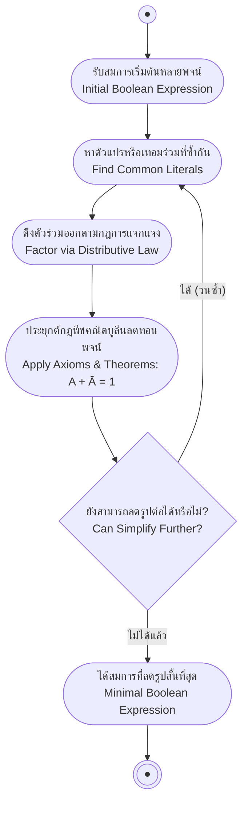

# การใช้พีชคณิตบูลีนลดรูปสมการลอจิก (Boolean Algebra Simplification)

<span class="material-symbols-outlined">arrow_back</span> กลับไปที่ [[Week3-MOC|MOC สัปดาห์ 3]] | ก่อนหน้า: [[Boolean-Algebra-Theorems]]

## <span class="material-symbols-outlined">key</span> Keyword

- **ลดรูปสมการ (Simplify/Minimize)** — ใช้กฎพีชคณิตบูลีนแปลงสมการให้มีพจน์/ตัวแปรน้อยที่สุด
- **Delay Time** — เวลาที่วงจรใช้ทำงานนับจาก Input ไปจนถึง Output
- **เป้าหมายการลดรูป** — ลดจำนวนเกต → ลดต้นทุน ลดพื้นที่วงจร และลด Delay Time ไปพร้อมกัน

## <span class="material-symbols-outlined">menu_book</span> Theory (เข้าใจง่าย)

การออกแบบวงจร Logic ใดๆ ควรลดรูปสมการ (Function) ให้น้อยที่สุดก่อนเสมอ เพราะจำนวนอุปกรณ์ในวงจรจะน้อยลง ต้นทุนการสร้างวงจรก็น้อยลงตามไปด้วย และยังช่วยลด Delay Time ของวงจรลงได้อีกด้วย ใช้กฎจาก [[Boolean-Algebra-Basics]] และ [[Boolean-Algebra-Theorems]] เป็นเครื่องมือหลัก

**ตัวอย่างที่ 1:** ลดรูป Y = BC + B̄C + BC̄

```
Y = BC + B̄C + BC̄
  = C(B + B̄) + BC̄     ← ดึง C ร่วมจาก 2 พจน์แรก
  = C·1 + BC̄            ← B+B̄ = 1
  = C + BC̄
  = C + B                ← C+BC̄ = (C+B)(C+C̄) = (C+B)·1 = C+B
```

> [!warning] จุดที่ต้องตรวจสอบกับสไลด์ต้นฉบับ
> สไลด์ต้นฉบับ (หน้า 16) เขียนบรรทัดสุดท้ายเป็น "C + B̄" แต่เมื่อตรวจด้วยตารางความจริงแล้วไม่ตรงกับสมการตั้งต้น (Y เป็น 1 ทุกครั้งที่ B=1 หรือ C=1 พอดี) คำตอบที่ถูกต้องคือ **C + B** — น่าจะเป็นจุดพิมพ์ผิดในสไลด์ ให้ยึด C+B เป็นหลักและลองพิสูจน์ด้วยตารางความจริงด้วยตัวเองอีกครั้ง

**ตัวอย่างที่ 2:** ลดรูป Y = ‾(ABC + ĀBC + BC) (บาร์ครอบทั้งสมการ)

```
Y = ‾(ABC + ĀBC + BC)
  = ‾(BC(A + Ā + 1))     ← ดึง BC ร่วมจากทั้ง 3 พจน์
  = ‾(BC)                 ← A+Ā+1 = 1
```

**ตัวอย่างที่ 3:** ลดรูป Y = AB̄C + AB̄C̄ + ABC + ABC̄

```
Y = AB̄C + AB̄C̄ + ABC + ABC̄
  = AB̄(C+C̄) + AB(C+C̄)   ← จับคู่ดึง C ร่วม
  = AB̄ + AB
  = A(B̄+B)
  = A
```

**ตัวอย่างที่ 4 (พร้อมวงจร):** ลดรูป Y = AB + ĀB + ĀB̄

```
Y = AB + ĀB + ĀB̄
  = B(A+Ā) + ĀB̄           ← ดึง B ร่วมจาก 2 พจน์แรก
  = B·1 + ĀB̄
  = B + ĀB̄
  = Ā + B                  ← ใช้กฎ A+ĀX=A+X (ทฤษฎีบท 9) โดยมอง A=B, X=Ā
```

วงจรก่อนลดรูปต้องใช้ 3 AND-gate + 1 OR-gate (รวมเกต NOT สำหรับ Ā, B̄) ส่วนวงจรหลังลดรูปเหลือแค่ 1 NOT-gate + 1 OR-gate เท่านั้น — ตรวจสอบด้วยตารางความจริงแล้วให้ผลลัพธ์เดียวกันทุกแถว

## <span class="material-symbols-outlined">schema</span> Diagram

**แนวทางทั่วไปในการลดรูปสมการด้วยพีชคณิตบูลีน:**



---
<span class="material-symbols-outlined">arrow_forward</span> ต่อไป: [[DeMorgans-Theorem]]
