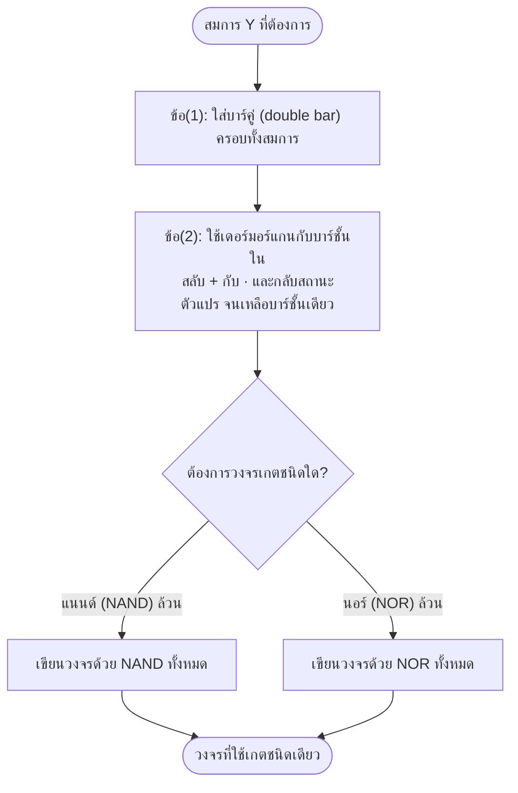

# ทฤษฎีเดอร์มอร์แกน (DeMorgan's Theorem)

⬅️ กลับไปที่ [[Week3-MOC|MOC สัปดาห์ 3]] | ก่อนหน้า: [[Boolean-Algebra-Simplification]]

## 🔑 Keyword

- **ทฤษฎีเดอร์มอร์แกน (DeMorgan's Theorem)** — คิดค้นโดยนักคณิตศาสตร์ชื่อ "เดอร์มอร์แกน" ใช้เปลี่ยนรูปสมการระหว่างคอมพลีเมนต์ของ AND กับ OR ของคอมพลีเมนต์ตัวแปร
- **บัฟเบิลออร์แทนแนนด์ (Bubble OR = NAND)** — (A·B)‾ = Ā+B̄
- **บัฟเบิลแอนด์แทนนอร์ (Bubble AND = NOR)** — (A+B)‾ = Ā·B̄

## 📖 Theory (เข้าใจง่าย)

ทฤษฎีเดอร์มอร์แกนให้คำนิยามว่า **สามารถเปลี่ยนรูปสมการลอจิกจากคอมพลีเมนต์ของแอนด์ เป็นการออร์กันของคอมพลีเมนต์ตัวแปร และเปลี่ยนรูปสมการจากคอมพลีเมนต์ของออร์ เป็นการแอนด์กันของคอมพลีเมนต์ตัวแปรได้**

**ทฤษฎีที่ 1:** (A·B)‾ = Ā+B̄

| A | B | Ā | B̄ | (A·B)‾ | Ā+B̄ |
| --- | --- | --- | --- | --- | --- |
| 0 | 0 | 1 | 1 | 1 | 1 |
| 0 | 1 | 1 | 0 | 1 | 1 |
| 1 | 0 | 0 | 1 | 1 | 1 |
| 1 | 1 | 0 | 0 | 0 | 0 |

**ทฤษฎีที่ 2:** (A+B)‾ = Ā·B̄

| A | B | Ā | B̄ | (A+B)‾ | Ā·B̄ |
| --- | --- | --- | --- | --- | --- |
| 0 | 0 | 1 | 1 | 1 | 1 |
| 0 | 1 | 1 | 0 | 0 | 0 |
| 1 | 0 | 0 | 1 | 0 | 0 |
| 1 | 1 | 0 | 0 | 0 | 0 |

ทั้งสองตารางคอลัมน์คู่เปรียบเทียบตรงกันทุกแถว → พิสูจน์ว่าทฤษฎีทั้งสองข้อเป็นจริง

### การใช้เดอร์มอร์แกนออกแบบวงจรด้วยเกตชนิดเดียว (NAND-only / NOR-only)

วิธีการ 3 ขั้นตอน:
1. ใส่เครื่องหมายบาร์ (BAR) ครอบตลอดทั้งสมการลอจิกจำนวน 2 ครั้ง (double bar)
2. ใช้ทฤษฎีเดอร์มอร์แกนกับบาร์ชั้นใน เพื่อเปลี่ยนสถานะของตัวแปร (สลับ + กับ · และกลับตัวแปรเป็นคอมพลีเมนต์) จนเหลือบาร์เพียงชั้นเดียว
3. นำสมการลอจิกที่ได้ไปเขียนวงจรลอจิกด้วยเกตชนิดเดียว (NAND ล้วน หรือ NOR ล้วน)

> [!warning] ตรวจสอบตัวอย่างกับสไลด์ต้นฉบับ
> สไลด์หน้า 21-22 มีตัวอย่างออกแบบวงจร NAND-only และ NOR-only จากสมการ (มีวงจรเกตที่วาดด้วยมือประกอบ) แต่สมการที่กำกับหัวข้อกับขั้นตอนการพิสูจน์ในสไลด์ดูไม่ตรงกันเป๊ะ (มีความเป็นไปได้ว่าเป็นจุดพิมพ์ผิดในสไลด์) — ให้เปิดไฟล์ต้นฉบับ `01_Lectures/02_Teaching_Slides/3. พีชคณิตบูลีน 2568.pdf` หน้า 21-22 ดูวงจรเกตประกอบโดยตรง แล้วไล่ตามหลักการ 3 ขั้นตอนด้านบนด้วยตัวเอง จะปลอดภัยกว่าจำสมการจากตัวอย่างเป๊ะๆ

## 🖼️ Diagram

---
⬅️ กลับไปที่ [[Week3-MOC|MOC สัปดาห์ 3]]
