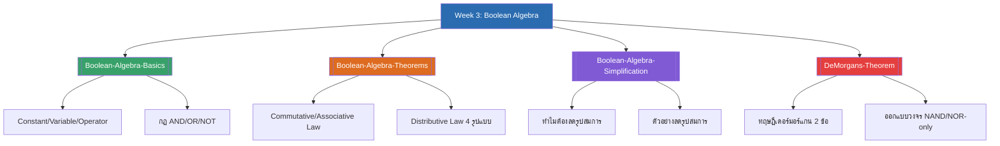

# Week 3 — Boolean Algebra (MOC)

⬅️ สัปดาห์ก่อนหน้า: [[Week2-MOC|MOC สัปดาห์ 2]]

## ✅ เช็คลิสต์ก่อนเข้าเรียน

- [ ] ทบทวนสัญลักษณ์ AND (`·`), OR (`+`), NOT (ขีดบน) — ดู [[Boolean-Algebra-Basics]]
- [ ] ท่องจำกฎพื้นฐานของ AND/OR/NOT ให้คล่อง (จะใช้ทุกครั้งที่ลดรูปสมการ) — ดู [[Boolean-Algebra-Basics]]
- [ ] ทบทวนกฎการสลับที่/รวมหมู่/กระจาย โดยเฉพาะกฎกระจายที่ต้องพิสูจน์ด้วยตารางความจริง — ดู [[Boolean-Algebra-Theorems]]
- [ ] ลองฝึกลดรูปสมการง่ายๆ ด้วยตัวเองก่อนเข้าเรียน — ดู [[Boolean-Algebra-Simplification]]
- [ ] ทำความเข้าใจว่า NAND และ NOR เป็นเกตที่ใช้แทนเกตชนิดอื่นได้ทั้งหมด — ดู [[DeMorgans-Theorem]]

## 📋 ภาพรวมสัปดาห์ 3 (สรุปย่อ)

สัปดาห์นี้เข้าสู่เนื้อหา **พีชคณิตบูลีน (Boolean Algebra)** ซึ่งเป็นเครื่องมือหลักที่ใช้ลดรูปสมการลอจิกให้สั้นที่สุดก่อนนำไปออกแบบวงจรจริง ครอบคลุม 3 ส่วนหลัก:

1. **ตัวคงที่/ตัวแปร/ตัวกระทำ และกฎพื้นฐานของ AND/OR/NOT** — สมบัติเบื้องต้นที่พิสูจน์ได้ตรงจากวงจรเกต
2. **กฎการสลับที่ รวมหมู่ กระจาย และการนำไปใช้ลดรูปสมการจริง** — เครื่องมือหลักในการลดจำนวนเกตของวงจร
3. **ทฤษฎีเดอร์มอร์แกน และการออกแบบวงจรด้วยเกตชนิดเดียว (NAND-only/NOR-only)** — เทคนิคที่ใช้จริงในอุตสาหกรรม เพราะ NAND/NOR ราคาถูกและผลิตง่ายกว่าเกตชนิดอื่น

## 🗺️ แผนที่หัวข้อสัปดาห์ 3

## 📚 โน้ตรายหัวข้อ

| หัวข้อ | เนื้อหาหลัก | หน้าสไลด์ |
| --- | --- | --- |
| [[Boolean-Algebra-Basics]] | Constant/Variable/Operator, กฎของ AND/OR/NOT | 3-9 |
| [[Boolean-Algebra-Theorems]] | Commutative Law, Associative Law, Distributive Law | 10-15 |
| [[Boolean-Algebra-Simplification]] | ทำไมต้องลดรูปสมการ, ตัวอย่างลดรูปสมการ 4 ข้อ | 16-18 |
| [[DeMorgans-Theorem]] | ทฤษฎีเดอร์มอร์แกน, ออกแบบวงจร NAND-only/NOR-only | 19-22 |
| [[Week3-Assignments]] | โจทย์ลดรูปสมการ/พิสูจน์ 5 ข้อ | 23-27 |

> [!tip] จุดที่มักสับสน
> - กฎการกระจายข้อ 1, 2 และ 4 (A+ĀB=A+B, Ā+AB=Ā+B, A+BC=(A+B)(A+C)) **ไม่ใช่สามัญสำนึกทางคณิตศาสตร์ปกติ** ต้องพิสูจน์ด้วยตารางความจริงเสมอ ห้ามมองข้ามแล้วเดาว่าจริง
> - การใช้เดอร์มอร์แกนออกแบบวงจรเกตชนิดเดียว ต้อง **ใส่บาร์คู่ก่อนเสมอ** แล้วเปิดบาร์ชั้นในด้วยเดอร์มอร์แกน อย่าลืมว่าเปิดบาร์ 1 ชั้นจะสลับ `+` กับ `·` และกลับสถานะตัวแปรทุกตัวข้างในไปพร้อมกัน

➡️ สัปดาห์ถัดไป: [[Week4-MOC|MOC สัปดาห์ 4]]
