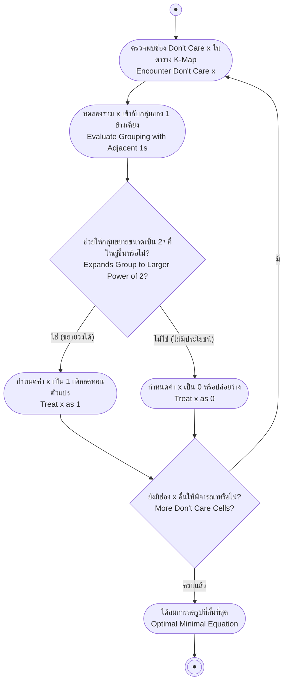

# เงื่อนไขที่ไม่สนใจ (Don't Care Condition)

arrow_back กลับไปที่ [[Week4-MOC|MOC สัปดาห์ 4]] | ก่อนหน้า: [[Kmap-Grouping-Rules]]

## key Keyword

- **เงื่อนไขที่ไม่สนใจ (Don't Care Condition)** — การกำหนดให้สถานะของมินเทอม/แมกเทอมบางค่าเป็นได้ทั้ง 0 หรือ 1 (มักเกิดจากอินพุตชุดนั้นไม่เคยเกิดขึ้นจริงในระบบ)
- **สัญลักษณ์ x หรือ d** — ใช้แทนช่องที่เป็นเงื่อนไขไม่สนใจในตาราง K-Map (เอกสารนี้ใช้ "x")
- **ประโยชน์** — ช่วยลดรูปสมการให้สั้นลงได้มากขึ้น เพราะเลือกได้ว่าจะรวม x เข้ากับวงไหนก็ได้

## menu_book Theory (เข้าใจง่าย)

เงื่อนไขที่ไม่สนใจคือการกำหนดให้สถานะของมินเทอมหรือแมกเทอมใดๆ เป็นได้ทั้ง 0 หรือ 1 ประโยชน์ของการนำเงื่อนไขที่ไม่สนใจมาใช้งานคือช่วยให้สามารถลดรูปสมการพีชคณิตบูลีนให้มีขนาดเล็กลงได้

> [!important] ข้อควรระวัง
> เงื่อนไขที่ไม่สนใจอาจทำให้สมการมีขนาด**ใหญ่ขึ้น**ได้ถ้าเลือกใช้ไม่ระวัง — ต้องเลือกใช้เฉพาะ x ที่ช่วยให้วงกลุ่ม **ใหญ่ขึ้นจริง** เท่านั้น ถ้า x ตัวไหนรวมแล้วไม่ได้ช่วยให้วงใหญ่ขึ้น ให้ปล่อยเป็น 0 (ไม่ใช้งาน) ไปเลย

### วิธีเลือกใช้ x

เมื่อจับกลุ่มบนตารางที่มี x ปนอยู่ ให้พิจารณาแต่ละ x ว่า **ถ้ารวม x เข้ากับวงข้างเคียงแล้วทำให้วงใหญ่ขึ้น** (2→4, 4→8, ...) ก็ให้ใช้ x นั้นเป็น 1 แต่ถ้ารวมแล้วไม่ได้ทำให้วงใหญ่ขึ้น หรือทำให้ต้องเพิ่มพจน์ใหม่โดยไม่จำเป็น ให้ปล่อย x นั้นเป็น 0 ไป — เลือกได้อิสระทีละตัวตามที่เป็นประโยชน์ที่สุด

**ตัวอย่างการเลือกผิด (ควรหลีกเลี่ยง):** ถ้ามองสถานะที่เป็นเงื่อนไขไม่สนใจ "ABCD" = 1110 ให้มีสถานะเป็น 1 จะพบว่าทำให้สมการพีชคณิตบูลีนมีขนาด**ใหญ่ขึ้น** (ต้องเพิ่มวงใหม่โดยไม่ได้ช่วยลดรูปพจน์อื่นเลย) — กรณีนี้ควรปล่อยให้เป็น 0 แทน

### ตัวอย่างประยุกต์ใช้จริง

จากระบบที่มีอินพุต A, B, C, D (เรียงลำดับความสำคัญจากมากไปน้อย A→D) และเอาต์พุต Z ที่ใช้งานจริงแค่ 10 ค่า (0000 ถึง 1001) ส่วนอีก 6 ค่าที่เหลือ (1010–1111) ไม่เคยเกิดขึ้นจริง จึงเป็นเงื่อนไขที่ไม่สนใจทั้งหมด เมื่อพลอตตารางความจริงลง K-Map แล้วเลือกใช้ x ที่เป็นประโยชน์ จะลดรูปสมการได้สั้นกว่ากรณีไม่มี x มาก

**ตัวอย่างที่ 2:** f(A,B,C,D) = Σm(1,3,7,11,15) + Σd(0,2,5) — เมื่อพลอต Minterm (1) และ Don't Care (d) ลง K-Map แล้วเลือกรวม d ที่ตำแหน่ง 0 และ 3(เดิม) เข้ากับวงข้างเคียงอย่างเหมาะสม จะลดรูปได้เป็น **ĀD + CD**

## schema Diagram

---
arrow_forward ต่อไป: [[Half-Full-Adder]]
