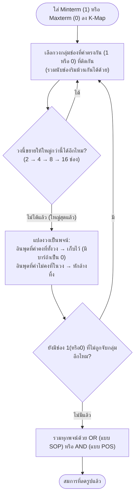

# กฎการจับกลุ่มและลดรูปด้วยแผนผังคาร์โนห์ (K-Map Grouping Rules)

⬅️ กลับไปที่ [[Week4-MOC|MOC สัปดาห์ 4]] | ก่อนหน้า: [[Kmap-Basics]]

## 🔑 Keyword

- **การสร้างลูป (Forming Loops)** — ขั้นตอนวงกลุ่มช่องที่มีค่า 1 (หรือ 0) ติดกัน เพื่อลดรูปสมการ
- **จับกลุ่มได้ครั้งละ 2ⁿ ตัว** — 1, 2, 4, 8, 16 เท่านั้น (ห้ามจับกลุ่ม 3 หรือ 5 ตัว)
- **คุณสมบัติม้วนโดยรอบ (Wrap-around)** — ริมซ้ายจับกลุ่มกับริมขวาได้, ริมบนจับกลุ่มกับริมล่างได้ (เหมือนพับกระดาษแล้วช่องทับกัน)
- **มองขึ้น-มองซ้าย** — เทคนิคอ่านค่าจากวงที่จับกลุ่มแล้วแปลงกลับเป็นพจน์สมการ

## 📖 Theory (เข้าใจง่าย)

### กฎการสร้างลูป (7 ข้อ)

1. เลือกช่องดำเนินการ คือเลือกเฉพาะช่องที่มีค่าเป็น 1 ทั้งหมด (ถ้าทำแบบ POS ให้เลือกช่อง 0 แทน)
2. ยุบรวมช่องที่มี 1 ติดกัน โดยแต่ละวงยุบได้ครั้งละ 2ⁿ ช่องเท่านั้น เช่น 1, 2, 4, 8, 16 ช่อง
3. การจับกลุ่มต้องจับกลุ่มให้ได้ **วงใหญ่ที่สุดเท่าที่ทำได้เสมอ**
4. ช่องที่อยู่ริมตาราง หากพับแผ่นตารางแล้วช่องทับกัน ถือว่าอยู่ติดกัน (คุณสมบัติม้วนโดยรอบ)
5. ช่องที่ถูกจับกลุ่มไปแล้วสามารถนำไปจับกลุ่มกับช่องอื่นซ้ำได้อีก
6. นำวงแต่ละวงมาแปลงเป็นมินเทอม: ดูสถานะอินพุตทั้งหมดของช่องในวง (มองขึ้น + มองซ้าย) — อินพุตตัวใดที่พบทั้ง 0 และ 1 ในวงเดียวกันให้ **หักล้างทิ้ง**, อินพุตตัวใดที่คงที่เป็น 1 ทั้งวงให้ใส่ตัวแปรนั้นตรงๆ, อินพุตตัวใดที่คงที่เป็น 0 ทั้งวงให้ใส่ตัวแปรนั้นแบบมีคอมพลีเมนต์
7. นำมินเทอมของทุกวงมาผ่านตัวดำเนินการ **ออร์** รวมกันเป็นสมการสุดท้าย

### ตัวอย่างการลดรูปแบบ SOP (3 ตัวแปร)

**ตัวอย่างที่ 1:** ตาราง AB(00,01,11,10)×C(0,1) มีค่า 1 เต็มแถว C=0 และ C=1 เฉพาะคอลัมน์ 01, 11 → ได้ 2 วง: วงที่ 1 (คอลัมน์ 00, C ทั้งสองแถว) = **ĀC**, วงที่ 2 (คอลัมน์ 11, C ทั้งสองแถว) = **AC** → รวมสมการ = **ĀC + AC**

**ตัวอย่างที่ 2:** วงที่ 1 (คอลัมน์ 01,11 ทั้งสองแถว, 4 ช่อง) = **B**, วงที่ 2 (คอลัมน์ 11,10 แถว C=1) = **AC** → รวมสมการ = **B + AC**

**ตัวอย่างที่ 3:** มีแค่ 2 ช่องเป็น 1 (คอลัมน์ 00 และ 10 แถว C=1) จับกลุ่มเป็น 1 วง (ใช้คุณสมบัติม้วนโดยรอบ เพราะ 00 กับ 10 อยู่ริมซ้าย-ริมขวา) = **B̄C**

### ตัวอย่างการลดรูป 4 ตัวแปร

จากสมการ Z ที่มี 6 มินเทอม เมื่อพลอตลง K-Map 4 ตัวแปรแล้วจับกลุ่มได้ 3 วง (วงละ 4, 2, 2 ช่องตามลำดับ) ได้สมการลดรูปเป็น **Ā + C̄D̄** (ตัวอย่างสองในสไลด์ให้ผลแบบเดียวกันโดยใช้มินเทอมชุดต่าง ๆ กัน — ดูตัวอย่างเต็มในไฟล์ต้นฉบับหน้า 14-15)

### จากตารางความจริงไปหาสมการโดยตรง

ไม่จำเป็นต้องเขียนสมการ SOP/POS ก่อน สามารถพลอตค่า Z จากตารางความจริงลง K-Map ได้ทันที แล้วจับกลุ่มตามปกติ

### การลดรูปแบบ POS (Product of Sum)

ขั้นตอนกลับด้านกับ SOP:

1. เลือกช่องดำเนินการ **0** ทั้งหมด (แทนที่จะเลือก 1)
2. ขั้นตอนจับกลุ่มเหมือนกับแบบ SOP ทุกประการ
3. นำวงแต่ละวงที่จับกลุ่มได้มาแปลงเป็น **แมกเทอม** (Maxterm)
4. นำแมกเทอมทั้งหมดมาผ่านตัวดำเนินการ **แอนด์**

**ตัวอย่าง:** ตาราง 3 ตัวแปรจับกลุ่มช่อง 0 ได้ 2 วง → วงที่ 1 = (B̄+C), วงที่ 2 = (A+C̄) → รวมสมการ = **(B̄+C)(A+C̄)**

> [!note] สรุปสั้น (Quick Reference)
> ใส่มินเทอม/แมกเทอมลงตาราง → จับกลุ่มช่องติดกันทีละ 2ⁿ ตัว ให้ได้วงใหญ่สุดเท่าที่ทำได้ → ช่องเดิมใช้ซ้ำได้ → อย่าลืมคุณสมบัติม้วนโดยรอบของตาราง

## 🖼️ Diagram

---
➡️ ต่อไป: [[Kmap-Dont-Care-Conditions]]
