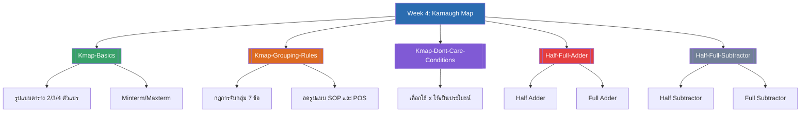

# Week 4 — Karnaugh Map (MOC)

⬅️ สัปดาห์ก่อนหน้า: [[Week3-MOC|MOC สัปดาห์ 3]]

## ✅ เช็คลิสต์ก่อนเข้าเรียน

- [ ] ทบทวนรูปแบบตาราง K-Map 2/3/4 ตัวแปร และทำไมต้องเรียงหัวตารางแบบรหัสเกรย์ — ดู [[Kmap-Basics]]
- [ ] ท่องกฎการจับกลุ่ม 7 ข้อให้คล่อง โดยเฉพาะ "จับกลุ่มได้ครั้งละ 2ⁿ ตัวเท่านั้น" — ดู [[Kmap-Grouping-Rules]]
- [ ] ลองฝึกลดรูปสมการ 2-3 ตัวแปรง่ายๆ ด้วยตัวเองก่อนเข้าเรียน — ดู [[Kmap-Grouping-Rules]]
- [ ] เข้าใจว่าเงื่อนไขที่ไม่สนใจ (x) เลือกใช้ได้อิสระ แต่ต้องเลือกเฉพาะที่ช่วยลดรูปจริง — ดู [[Kmap-Dont-Care-Conditions]]
- [ ] ทบทวนความต่างของ Half Adder/Subtractor (ไม่มีตัวทด/ยืมขาเข้า) กับ Full Adder/Subtractor (มี) — ดู [[Half-Full-Adder]], [[Half-Full-Subtractor]]

## 📋 ภาพรวมสัปดาห์ 4 (สรุปย่อ)

สัปดาห์นี้เข้าสู่เนื้อหา **แผนผังคาร์โนห์ (Karnaugh Map)** ซึ่งเป็นเครื่องมือลดรูปสมการพีชคณิตบูลีนด้วยตาราง เร็วและง่ายกว่าใช้กฎพีชคณิตล้วนๆ ครอบคลุม 3 ส่วนหลัก:

1. **พื้นฐาน K-Map** — รูปแบบตาราง 2/3/4 ตัวแปร และการอ่านค่าลงตาราง (SOP/POS)
2. **กฎการจับกลุ่มและลดรูป** — ทั้งแบบ SOP และ POS พร้อมเงื่อนไขที่ไม่สนใจ (Don't Care Condition)
3. **การประยุกต์ใช้ K-Map ออกแบบวงจรบวก/ลบเลขฐานสอง** — Half/Full Adder และ Half/Full Subtractor (สัปดาห์นี้เนื้อหาหนักที่สุดในบรรดา 4 สัปดาห์แรก รวม 65 หน้าสไลด์)

## 🗺️ แผนที่หัวข้อสัปดาห์ 4

## 📚 โน้ตรายหัวข้อ

| หัวข้อ | เนื้อหาหลัก | หน้าสไลด์ |
| --- | --- | --- |
| [[Kmap-Basics]] | รูปแบบตาราง 2/3/4 ตัวแปร, Minterm/Maxterm, การอ่านค่าลงตาราง | 1-9 |
| [[Kmap-Grouping-Rules]] | กฎการจับกลุ่ม 7 ข้อ, ตัวอย่างลดรูปแบบ SOP/POS | 10-20 |
| [[Kmap-Dont-Care-Conditions]] | เงื่อนไขที่ไม่สนใจ, ตัวอย่างประยุกต์ใช้จริง | 38-46 |
| [[Half-Full-Adder]] | Half Adder, Full Adder | 47-60 |
| [[Half-Full-Subtractor]] | Half Subtractor, Full Subtractor | 61-65 |
| [[Week4-Assignments]] | โจทย์ลดรูป K-Map 2/3/4 ตัวแปร | 22-25, 27-28, 31, 33, 35-37 |

> [!tip] จุดที่มักสับสน
> - จับกลุ่มได้แค่ **2ⁿ ตัว** (1, 2, 4, 8, 16) เท่านั้น ห้ามจับกลุ่ม 3, 5, 6 ช่อง
> - อย่าลืม**คุณสมบัติม้วนโดยรอบ** — ริมซ้ายจับกับริมขวาได้ ริมบนจับกับริมล่างได้ พลาดจุดนี้บ่อยที่สุด
> - เงื่อนไขที่ไม่สนใจ (x) **ต้องเลือกใช้เฉพาะตัวที่ช่วยลดรูปจริง** ใช้มั่วอาจทำให้สมการใหญ่ขึ้นแทน

➡️ สัปดาห์ถัดไป: [[Week5-MOC|MOC สัปดาห์ 5]]
