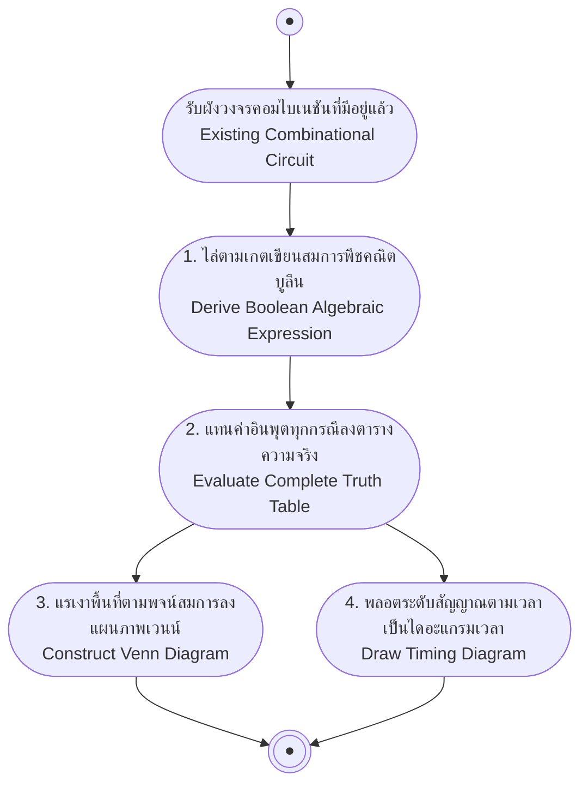

# การวิเคราะห์วงจรคอมไบเนชัน (Combinational Circuit Analysis)

arrow_back กลับไปที่ [[Week5-MOC|MOC สัปดาห์ 5]] | ก่อนหน้า: [[Combinational-Circuit-Design-Basics]]

## key Keyword

- **การวิเคราะห์วงจร (Circuit Analysis)** — ทิศทางตรงข้ามกับการออกแบบ: มีวงจรอยู่แล้ว ต้องหาสมการ/ตารางความจริง/เวนไดอะแกรม/ไดอะแกรมเวลาย้อนกลับ
- **เวนไดอะแกรม (Venn Diagram)** — ใช้แสดงพื้นที่ทับซ้อนของตัวแปรเพื่อยืนยันความถูกต้องของสมการ
- **ไดอะแกรมเวลา (Timing Diagram)** — แสดงค่าลอจิกของสัญญาณตามแกนเวลา แทนที่จะแสดงเป็นตาราง

## menu_book Theory (เข้าใจง่าย)

นำวงจรคอมไบเนชันไปเขียนเป็น**สมการพีชคณิตบูลีน**ก่อน ซึ่งสามารถนำไปเขียนเป็นตารางความจริง เวนไดอะแกรม หรือไดอะแกรมเวลาต่อได้อีก

**ตัวอย่าง (Ex.3):** จากวงจรที่มี XOR(A,B) ต่อ NOT (ได้ (A⊕B)‾) ไปเข้า OR gate ร่วมกับผลของ NOT(A) AND C (ได้ ĀC) จะได้สมการ:

$$Y = \overline{A \oplus B} + \bar{A}C$$

### จากสมการ → ตารางความจริง

| A | B | C | (A⊕B)‾ | Ā | ĀC | Y |
| --- | --- | --- | --- | --- | --- | --- |
| 0 | 0 | 0 | 1 | 1 | 0 | 1 |
| 0 | 0 | 1 | 1 | 1 | 1 | 1 |
| 0 | 1 | 0 | 0 | 1 | 0 | 0 |
| 0 | 1 | 1 | 0 | 1 | 1 | 1 |
| 1 | 0 | 0 | 0 | 0 | 0 | 0 |
| 1 | 0 | 1 | 0 | 0 | 0 | 0 |
| 1 | 1 | 0 | 1 | 0 | 0 | 1 |
| 1 | 1 | 1 | 1 | 0 | 0 | 1 |

### จากสมการ → เวนไดอะแกรม

วาดวงกลม A, B, C ทับซ้อนกัน แล้วแรเงาพื้นที่ตามแต่ละพจน์ของสมการ: พื้นที่ของ (A⊕B)‾ คือส่วนที่**อยู่นอกทั้งสองวงพร้อมกัน หรืออยู่ในทั้งสองวงพร้อมกัน** (ตรงข้ามกับ XOR ที่แรเงาเฉพาะส่วนที่อยู่ในวงใดวงหนึ่งเพียงวงเดียว) ส่วนพื้นที่ของ ĀC คือส่วนที่อยู่ใน C แต่ไม่อยู่ใน A แล้วนำสองพื้นที่มารวมกัน (OR) ได้พื้นที่สุดท้ายของ Y

### จากสมการ → ไดอะแกรมเวลา (Timing Diagram)

วาดคลื่นสัญญาณของ A, B, C ตามลำดับเวลา (มักไล่ตามลำดับเลขฐานสองทั้ง 8 ค่า) แล้ววาดคลื่นของแต่ละพจน์ย่อย ((A⊕B)‾, Ā, ĀC) ตามเวลาเดียวกัน สุดท้ายรวมเป็นคลื่นของ Y — ค่าที่ได้ตรงกับตารางความจริงทุกประการ เพียงแต่แสดงผลเป็นรูปคลื่นตามแกนเวลาแทนตาราง

> [!tip] เคล็ดลับ
> ทั้ง 4 รูปแบบ (สมการ, ตารางความจริง, เวนไดอะแกรม, ไดอะแกรมเวลา) คือการแสดงผลข้อมูล**ชุดเดียวกัน**ในรูปแบบต่างกันเท่านั้น — ถ้าคำนวณตารางความจริงถูก จะแปลงไปเป็นรูปแบบอื่นได้ถูกต้องเสมอ

## schema Diagram

---
arrow_forward ต่อไป: [[Encoders-Decoders]]
