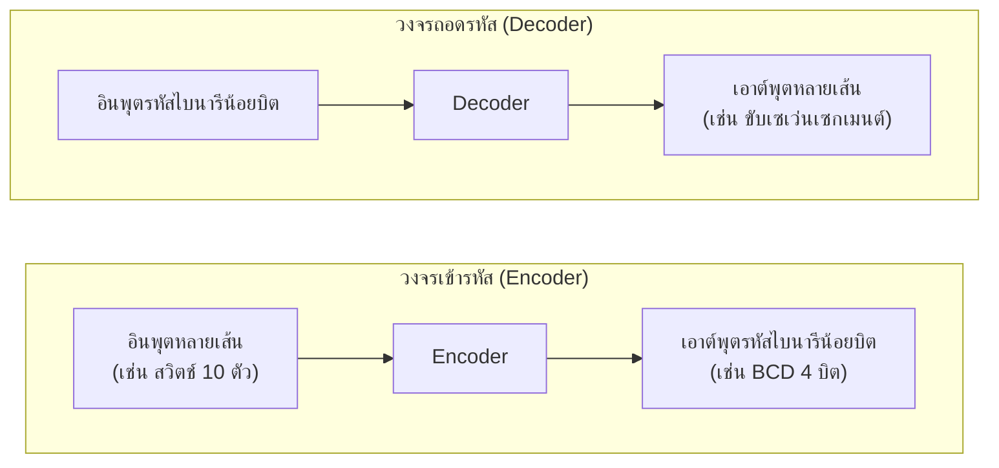

# วงจรเข้ารหัส วงจรถอดรหัส และเซเว่นเซกเมนต์ (Encoder, Decoder, Seven-Segment)

⬅️ กลับไปที่ [[Week5-MOC|MOC สัปดาห์ 5]] | ก่อนหน้า: [[Combinational-Circuit-Analysis]]

## 🔑 Keyword

- **วงจรเข้ารหัส (Encoder Circuit)** — รับข้อมูลทางอินพุตแล้วแปลงเป็นเลขฐานสอง (หลายอินพุต → รหัสไบนารีน้อยบิต)
- **วงจรถอดรหัส (Decoder Circuit)** — เปลี่ยนอินพุตเลขฐานสอง N บิต เป็นเอาต์พุต M บิตตามต้องการ (ทิศทางตรงข้ามกับ Encoder)
- **IC 74148** — Encoder 8 Data Lines to 3-Line Binary (priority encoder จริงที่ใช้งานทั่วไป)
- **IC 74138** — 3-to-8 Line Decoder (decoder จริงที่ใช้งานทั่วไป)
- **Common Anode / Common Cathode** — 2 ชนิดของเซเว่นเซกเมนต์ ตามวิธีต่อจุดร่วม

## 📖 Theory (เข้าใจง่าย)

### วงจรเข้ารหัส (Encoder)

วงจรเข้ารหัส (Encoder circuit) เป็นวงจรที่รับข้อมูลทางอินพุตแล้วแปลงเป็นเลขฐานสอง อินพุตที่รับเข้ามาเช่น แป้นคีย์บอร์ด เมื่อเรากดแป้นคีย์บอร์ดเลขใดเลขหนึ่ง จะได้ค่าอินพุตเข้ามาในวงจรเข้ารหัส วงจรนี้จะเปลี่ยนอินพุตที่เข้ามาเป็นค่าเลขฐานสอง เช่น กดแป้นคีย์เลข 5 จะได้ค่าเอาต์พุตเป็น 0101

**ตัวอย่าง:** วงจรเข้ารหัสจากสวิตช์ 10 ตัว (เลข 0-9) → เอาต์พุต A, B, C, D (รหัส BCD 4 บิต) กดสวิตช์ตัวที่ 5 → เอาต์พุต D,B = 1 ที่เหลือเป็น 0 → 0101₂

**ในปัจจุบัน** มีไอซีวงจรเข้ารหัสสำเร็จรูปให้ใช้งาน เช่น **ไอซีเบอร์ 74148** (Encoder 8 Data Lines to 3-Line Binary) — รับอินพุต 8 เส้น (0-7) มีเอาต์พุตหลัก A2,A1,A0 (รหัสฐานสอง 3 บิต) พร้อมขา EI (Enable Input), GS, EO เสริม โดยเป็น **priority encoder** คือถ้ามีหลายอินพุตเป็น 1 พร้อมกัน จะให้ผลลัพธ์ของอินพุตที่มีลำดับความสำคัญสูงสุด (เลขมากสุด) เท่านั้น — ตารางความจริงใช้สัญลักษณ์ H=ลอจิก 1, L=ลอจิก 0, X=Don't Care

### วงจรถอดรหัส (Decoder)

วงจรถอดรหัส (Decoder circuit) หมายถึงวงจรที่เปลี่ยนอินพุตเลขฐานสองจำนวน N เป็นเอาต์พุตเลขฐานสองจำนวน M ตามต้องการ หรือเป็นวงจรที่ทำหน้าที่เปลี่ยนกลุ่มของรหัสเลขฐานสองที่เข้ามาให้เป็นเลขฐานอื่นตามต้องการ เช่น เปลี่ยนอินพุตรหัส BCD เป็นรหัสเลขฐานสิบแล้วส่งต่อไปยังภาคแสดงผลเพื่อให้มนุษย์รับรู้

**ตัวอย่าง (2-to-4 Line Decoder):** อินพุต A, B (2 บิต) → เอาต์พุต Y0-Y3 (4 เส้น มีแค่เส้นเดียวเป็น 1 ตามค่า AB) วงจรใช้ NOT gate กลับสถานะ A, B แล้ว AND รวมกันทีละคู่ (เช่น Y0 = ĀB̄, Y1 = ĀB, Y2 = AB̄, Y3 = AB)

**ไอซีเบอร์ 74138** (3-to-8 Line Decoder) — อินพุต Select A, B, C (3 บิต) + Enable G1, G2A, G2B → เอาต์พุต Y0-Y7 (มีแค่เส้นเดียว active-low ตามค่า select) ใช้จริงในวงจรถอดรหัสที่อยู่หน่วยความจำและระบบดิจิทัลทั่วไป

### การแสดงผลด้วยเซเว่นเซกเมนต์ (Seven-Segment Display)

เมื่อมีวงจรเข้ารหัสและวงจรถอดรหัสแล้ว ขั้นตอนสุดท้ายคือทำให้มนุษย์รับรู้ข้อมูลเลขฐานสิบได้ นิยมใช้ **เซเว่นเซกเมนต์** แบ่งตามการต่อจุดร่วม (Common) ได้ 2 ชนิด:

| ชนิด | จุดร่วม | ต้องป้อนไฟ | IC ถอดรหัส BCD ที่ใช้คู่กัน | เอาต์พุต IC |
| --- | --- | --- | --- | --- |
| Common Anode (คอมมอนบวก +) | ขั้วบวกร่วม | ไฟลบ (-) เข้าเซกเมนต์ที่ต้องการแสดงผล | IC 7447 | ลอจิกลบ (-) |
| Common Cathode (คอมมอนลบ -) | ขั้วลบร่วม | ไฟบวก (+) เข้าเซกเมนต์ที่ต้องการแสดงผล | IC 7448 | ลอจิกบวก (+) |

โครงสร้างเซกเมนต์มี 7 ขา (a, b, c, d, e, f, g) เรียงเป็นรูปเลข 8 บวกจุดทศนิยม (dp) การต่อใช้งานจริงต้องมีตัวต้านทานจำกัดกระแส (เช่น R330 × 7 เส้น) คั่นระหว่าง IC ถอดรหัสกับแต่ละขาของเซเว่นเซกเมนต์เสมอ

## 🖼️ Diagram

---
⬅️ กลับไปที่ [[Week5-MOC|MOC สัปดาห์ 5]]
