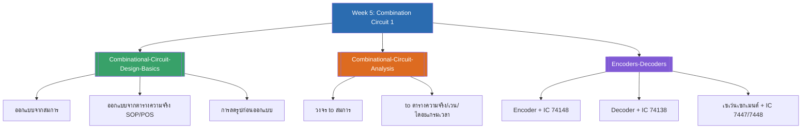

# Week 5 — Combination Circuit ชุดที่ 1 (MOC)

arrow_back สัปดาห์ก่อนหน้า: [[Week4-MOC|MOC สัปดาห์ 4]]

## check_circle เช็คลิสต์ก่อนเข้าเรียน

- [ ] ทบทวนนิยามวงจรคอมไบเนชัน (เอาต์พุตขึ้นกับอินพุตปัจจุบันเท่านั้น ไม่มี feedback) — ดู [[Combinational-Circuit-Design-Basics]]
- [ ] ฝึกออกแบบวงจรจากสมการ/ตารางความจริงทั้งแบบ SOP และ POS — ดู [[Combinational-Circuit-Design-Basics]]
- [ ] ทบทวนวิธีวิเคราะห์วงจรย้อนกลับเป็นสมการ/ตารางความจริง/เวนไดอะแกรม/ไดอะแกรมเวลา — ดู [[Combinational-Circuit-Analysis]]
- [ ] เข้าใจความต่างของ Encoder (หลายอินพุต → รหัสน้อยบิต) กับ Decoder (รหัสน้อยบิต → หลายเอาต์พุต) — ดู [[Encoders-Decoders]]
- [ ] รู้จัก Common Anode/Cathode ของเซเว่นเซกเมนต์ และ IC 7447/7448 — ดู [[Encoders-Decoders]]

## assignment ภาพรวมสัปดาห์ 5 (สรุปย่อ)

สัปดาห์นี้เข้าสู่เนื้อหา **วงจรคอมไบเนชัน (Combination Circuit)** ชุดที่ 1 จาก 2 ชุด (เนื้อหาต่อเนื่องยาวมาก จึงแบ่งเป็น 2 สัปดาห์ — ชุดที่ 2 อยู่ที่ [[../Week6/Week6-MOC|Week6]]) ครอบคลุม 3 ส่วนหลัก:

1. **พื้นฐานการออกแบบวงจรคอมไบเนชัน** — จากสมการและตารางความจริง (SOP/POS) พร้อมความสำคัญของการลดรูปก่อนออกแบบ
2. **การวิเคราะห์วงจรคอมไบเนชัน** — ทิศทางย้อนกลับ จากวงจรที่มีอยู่แล้วไปหาสมการ/ตารางความจริง/เวนไดอะแกรม/ไดอะแกรมเวลา
3. **วงจรเข้ารหัส วงจรถอดรหัส และเซเว่นเซกเมนต์** — การประยุกต์ใช้จริงด้วย IC 74148 (Encoder), IC 74138 (Decoder), IC 7447/7448 (ขับเซเว่นเซกเมนต์)

## map แผนที่หัวข้อสัปดาห์ 5

## collections_bookmark โน้ตรายหัวข้อ

| หัวข้อ | เนื้อหาหลัก | หน้าสไลด์ |
| --- | --- | --- |
| [[Combinational-Circuit-Design-Basics]] | นิยาม, ออกแบบจากสมการ/ตารางความจริง, การลดรูปก่อนออกแบบ | 1-3, 5-6, 11-13, 18, 20 |
| [[Combinational-Circuit-Analysis]] | วงจร → สมการ → ตารางความจริง/เวนไดอะแกรม/ไดอะแกรมเวลา | 7-10 |
| [[Encoders-Decoders]] | Encoder, Decoder, IC 74148/74138, เซเว่นเซกเมนต์, IC 7447/7448 | 21-31 |
| [[Week5-Assignments]] | โจทย์ออกแบบวงจร 6 ชุด | 4, 14-17, 19, 32 |

> [!tip] จุดที่มักสับสน
> - **SOP มองแถวที่ output=1** ส่วน **POS มองแถวที่ output=0** (สลับกันตรงข้ามพอดี เหมือน Minterm/Maxterm ใน K-Map ของ [[../Week4/Kmap-Basics|Week4]])
> - **Encoder กับ Decoder ทำงานตรงข้ามกัน** — Encoder รวมอินพุตหลายเส้นให้เหลือรหัสน้อยบิต ส่วน Decoder ขยายรหัสน้อยบิตให้เป็นเอาต์พุตหลายเส้น
> - วงจรคอมไบเนชัน**ต้องไม่มี feedback** จากเอาต์พุตกลับมาที่อินพุต ถ้ามีจะกลายเป็นวงจรเชิงลำดับ (Sequential Circuit) ซึ่งเป็นคนละเรื่องกัน

arrow_forward สัปดาห์ถัดไป: [[../Week6/Week6-MOC|MOC สัปดาห์ 6]]
