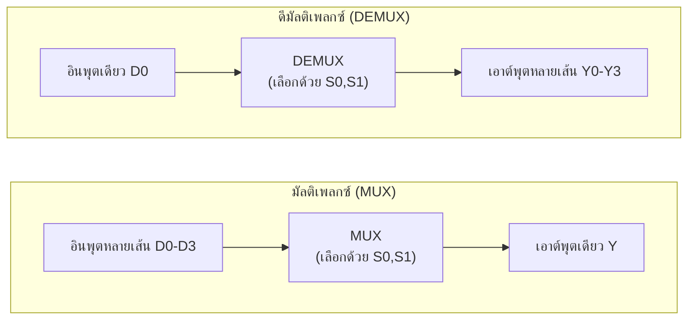

# มัลติเพลกซ์และดีมัลติเพลกซ์ (Multiplexer & Demultiplexer)

⬅️ กลับไปที่ [[Week6-MOC|MOC สัปดาห์ 6]] | ก่อนหน้า: [[Single-Gate-Type-Design]]

## 🔑 Keyword

- **มัลติเพลกซ์ (Multiplexer, MUX)** — วงจรเลือกส่งข้อมูลจากหลายอินพุต **รวมลงสายเดียว** (many-to-one)
- **ดีมัลติเพลกซ์ (Demultiplexer, DEMUX)** — วงจรกระจายข้อมูลจากอินพุตเดียว **ออกไปหลายเอาต์พุต** (one-to-many) — ทิศทางตรงข้ามกับ MUX
- **Select Inputs / Select Outputs** — สายเลือกที่กำหนดว่าจะใช้อินพุต/เอาต์พุตเส้นไหน

## 📖 Theory (เข้าใจง่าย)

กรณีที่ต้องการส่งข้อมูลทาง Digital หลายข้อมูลไปในสายส่งเส้นเดียวกัน ทำได้โดยใช้วิธีการ **Multiplex** ในทางตรงกันข้าม ถ้าต้องส่งอินพุตชุดเดียวและกระจายออกไปหลายเอาต์พุต จะใช้วิธีการ **Demultiplex**

### มัลติเพลกซ์เซอร์ขนาดเข้า 4 ออก 1 (4-to-1 Multiplexer)

อินพุตข้อมูล D₀-D₃ + สายเลือก S₀, S₁ (2 บิต เลือกได้ 4 กรณี) → เอาต์พุตเดียว Y

| S₀ | S₁ | Y |
| --- | --- | --- |
| 0 | 0 | D₀ |
| 0 | 1 | D₁ |
| 1 | 0 | D₂ |
| 1 | 1 | D₃ |

**สมการ:**
$$Y = D_0\bar{S_0}\bar{S_1} + D_1\bar{S_0}S_1 + D_2 S_0\bar{S_1} + D_3 S_0 S_1$$

วงจร: ใช้ **AND gate 4 ตัว** (แต่ละตัวรับ Dᵢ + คู่ S₀,S₁ ที่ตรงกับแถวนั้น) แล้วนำผลทั้ง 4 ไปเข้า **OR gate 1 ตัว** รวมเป็น Y (พร้อม NOT gate 2 ตัวสำหรับสร้าง S̄₀, S̄₁)

### ดีมัลติเพลกซ์เซอร์ขนาดเข้า 1 ออก 4 (1-to-4 Demultiplexer)

อินพุตข้อมูลเดียว D₀ + สายเลือก S₀, S₁ → เอาต์พุต 4 เส้น Y₀-Y₃ (มีแค่เส้นเดียวที่ได้รับค่า D₀ ตามสายเลือก ที่เหลือเป็น 0)

| S₀ | S₁ | Y₀ | Y₁ | Y₂ | Y₃ |
| --- | --- | --- | --- | --- | --- |
| 0 | 0 | D₀ | 0 | 0 | 0 |
| 0 | 1 | 0 | D₀ | 0 | 0 |
| 1 | 0 | 0 | 0 | D₀ | 0 |
| 1 | 1 | 0 | 0 | 0 | D₀ |

**สมการ:**
$$Y_0 = D_0\bar{S_0}\bar{S_1} \quad Y_1 = D_0\bar{S_0}S_1 \quad Y_2 = D_0 S_0\bar{S_1} \quad Y_3 = D_0 S_0 S_1$$

> [!tip] จุดสังเกต
> MUX กับ DEMUX เป็นวงจรที่ **สมมาตรกันทางโครงสร้าง** — ถ้าสลับทิศทางสัญญาณของวงจร MUX (ให้ Y เป็นอินพุต และ D₀-D₃ เป็นเอาต์พุต) จะได้พฤติกรรมแบบ DEMUX ทันที เหมือนกับความสัมพันธ์ระหว่าง [[../Week5/Encoders-Decoders|Encoder กับ Decoder]] ในสัปดาห์ที่แล้ว

## 🖼️ Diagram

---
⬅️ กลับไปที่ [[Week6-MOC|MOC สัปดาห์ 6]]
