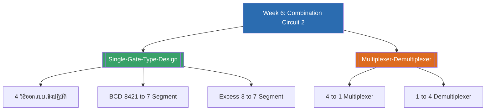

# Week 6 — Combination Circuit ชุดที่ 2 (MOC)

arrow_back สัปดาห์ก่อนหน้า: [[../Week5/Week5-MOC|MOC สัปดาห์ 5]]

## check_circle เช็คลิสต์ก่อนเข้าเรียน

- [ ] ทบทวน 4 วิธีออกแบบวงจรในทางปฏิบัติ (AND/OR, NAND-only, OR/AND, NOR-only) — ดู [[Single-Gate-Type-Design]]
- [ ] ทบทวนเทคนิคใส่บาร์คู่ + เดอร์มอร์แกนจาก [[../Week3/DeMorgans-Theorem|Week3]] เพราะใช้ซ้ำตอนแปลงเป็น NAND-only/NOR-only
- [ ] เข้าใจความต่างของ MUX (หลายอินพุต → เอาต์พุตเดียว) กับ DEMUX (อินพุตเดียว → หลายเอาต์พุต) — ดู [[Multiplexer-Demultiplexer]]
- [ ] ลองเติมตารางเซเว่นเซกเมนต์เลข 2-7 ด้วยตัวเองก่อนเข้าเรียน — ดู [[Single-Gate-Type-Design]]

## assignment ภาพรวมสัปดาห์ 6 (สรุปย่อ)

สัปดาห์นี้เป็นเนื้อหาต่อเนื่องจาก [[../Week5/Week5-MOC|Week5]] (วงจรคอมไบเนชัน ชุดที่ 2 จาก 2 ชุด) ครอบคลุม 2 ส่วนหลัก:

1. **การออกแบบวงจรด้วยเกตชนิดเดียว** — นำเทคนิคเดอร์มอร์แกนจาก Week3 มาผสมกับ K-Map จาก Week4 ออกแบบวงจรถอดรหัสขับเซเว่นเซกเมนต์จริง 2 กรณีศึกษา (BCD-8421 และ Excess-3)
2. **มัลติเพลกซ์และดีมัลติเพลกซ์** — วงจรเลือก/กระจายสัญญาณที่ใช้กันแพร่หลายในระบบดิจิทัลจริง

## map แผนที่หัวข้อสัปดาห์ 6

## collections_bookmark โน้ตรายหัวข้อ

| หัวข้อ | เนื้อหาหลัก | หน้าสไลด์ |
| --- | --- | --- |
| [[Single-Gate-Type-Design]] | 4 วิธีออกแบบเชิงปฏิบัติ, กรณีศึกษา BCD-8421/Excess-3 to 7-Segment | 2-17 |
| [[Multiplexer-Demultiplexer]] | 4-to-1 Multiplexer, 1-to-4 Demultiplexer | 18-21 |

> [!tip] จุดที่มักสับสน
> - วิธี **AND/OR และ NAND-only ใช้มินเทอม (1)** ลง K-Map ส่วนวิธี **OR/AND และ NOR-only ใช้แมกเทอม (0)** — สลับกันตรงข้ามพอดี เหมือน SOP/POS ที่เรียนมาตลอด
> - แปลงเป็น NAND-only/NOR-only **ต้องใส่บาร์คู่ก่อนเสมอ** แล้วเปิดบาร์ชั้นในด้วยเดอร์มอร์แกน (เทคนิคเดียวกับ [[../Week3/DeMorgans-Theorem|Week3]] เป๊ะ)
> - **MUX รวมสัญญาณ**จากหลายเส้นเหลือเส้นเดียว ส่วน **DEMUX กระจายสัญญาณ**จากเส้นเดียวออกไปหลายเส้น — ทิศทางตรงข้ามกัน

> [!note] เนื้อหา Digital Logic Design ที่ grill ไว้ (Week3-6) ครบแล้ว
> นี่คือสัปดาห์สุดท้ายของชุดที่ขอสรุปไว้ ("week 3-5" เดิม ขยายเป็น 3-6 เพราะแยกวงจรคอมไบเนชันเป็น 2 สัปดาห์) หากต้องการสรุปสัปดาห์ถัดไปเพิ่ม แจ้งได้เลย
