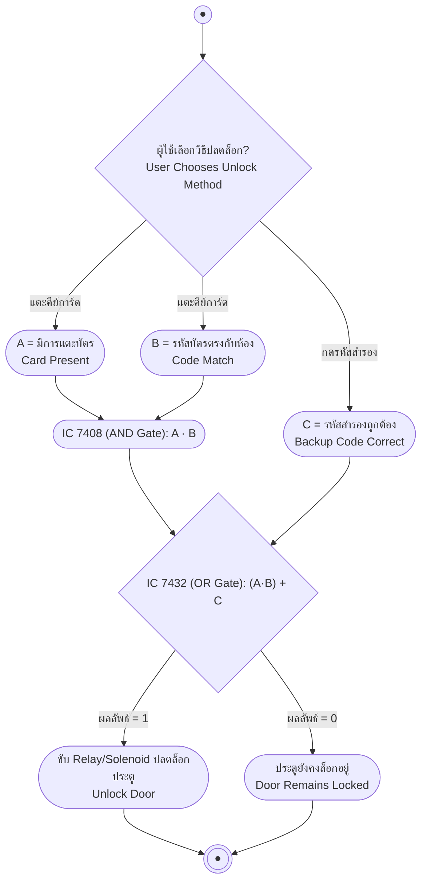

# ระบบปลดล็อกประตูด้วยคีย์การ์ดและรหัสสำรอง (Key Card Door Unlocking System with Backup Code)

> [!info] เกี่ยวกับโน้ตนี้
> เอกสารนี้สรุปเฉพาะ**ระบบที่ได้ออกแบบและนำไป Implement จริง** สำหรับงานค้นคว้าหัวข้อที่ได้รับมอบหมาย ไม่ใช่การรวบรวมทฤษฎีทั่วไปของระบบล็อกประตูทุกประเภท

## key Keyword

- **คีย์การ์ด (Key Card)** — บัตรที่มีรหัสประจำห้อง ใช้แตะกับเครื่องอ่านเพื่อขอปลดล็อกประตู
- **IC 7408 (Quad 2-Input AND Gate)** — ไอซีที่ใช้ตรวจสอบเงื่อนไขฝั่งคีย์การ์ด 2 อย่างพร้อมกัน คือ "มีการแตะบัตร" (A) และ "รหัสบัตรตรงกับห้อง" (B) ต้องเป็น 1 ทั้งคู่เอาต์พุตถึงเป็น 1
- **IC 7432 (Quad 2-Input OR Gate)** — ไอซีที่ใช้รวมผลจาก AND Gate เข้ากับสัญญาณรหัสสำรอง (C) เพื่อสั่งปลดล็อกขั้นสุดท้าย ทางใดทางหนึ่งเป็นจริงก็ปลดล็อกได้
- **รหัสสำรอง (Backup Code)** — รหัสที่กดด้วยมือผ่านปุ่มกด ใช้ปลดล็อกได้ทันทีโดยไม่ต้องพึ่งคีย์การ์ด (สำรองไว้กรณีบัตรหายหรือเครื่องอ่านเสีย)

## menu_book Theory (เข้าใจง่าย)

### หลักการทำงานของระบบ

ระบบนี้ปลดล็อกประตูได้ 2 เส้นทาง โดยใช้ตัวแปรอินพุต 3 ตัว:

- **A** = มีการแตะคีย์การ์ดที่เครื่องอ่าน (Card Present)
- **B** = รหัสที่อ่านได้จากคีย์การ์ดตรงกับรหัสประจำห้อง (Code Match)
- **C** = กดรหัสสำรองถูกต้องผ่านปุ่มกดด้วยมือ (Backup Code Correct)

**เส้นทางที่ 1 — ผ่านคีย์การ์ด:** ต้องมีเงื่อนไข A และ B เป็นจริง**พร้อมกัน**เท่านั้น ตรวจสอบด้วย **AND Gate**:

$$Y_{card} = A \cdot B$$

**เส้นทางที่ 2 — ผ่านรหัสสำรอง:** ถ้ากดรหัสสำรองถูกต้อง (C) จะปลดล็อกได้ทันทีโดยไม่ต้องมีคีย์การ์ดเลย

จากนั้นนำผลของทั้ง 2 เส้นทางมารวมกันด้วย **OR Gate** เพื่อให้ประตูปลดล็อกได้ถ้ามีทางใดทางหนึ่งเป็นจริง:

$$Unlock = (A \cdot B) + C$$

> [!example] ตารางความจริง (Truth Table)
>
> | A (แตะบัตร) | B (รหัสตรง) | C (รหัสสำรองถูก) | A·B | Unlock = A·B + C |
> | :---: | :---: | :---: | :---: | :---: |
> | 0 | 0 | 0 | 0 | 0 |
> | 0 | 0 | 1 | 0 | 1 |
> | 0 | 1 | 0 | 0 | 0 |
> | 0 | 1 | 1 | 0 | 1 |
> | 1 | 0 | 0 | 0 | 0 |
> | 1 | 0 | 1 | 0 | 1 |
> | 1 | 1 | 0 | 1 | 1 |
> | 1 | 1 | 1 | 1 | 1 |

> [!important] จุดสำคัญของวงจร
> แค่แตะคีย์การ์ด (A=1) เพียงอย่างเดียวโดยที่รหัสไม่ตรงกับห้อง (B=0) จะ**ไม่ปลดล็อก** เพราะ AND Gate ต้องการให้ A และ B เป็น 1 พร้อมกันเท่านั้น — ส่วนรหัสสำรอง (C) ทำงาน**อิสระจากเส้นทางคีย์การ์ดโดยสิ้นเชิง** เพราะเชื่อมเข้า OR Gate โดยตรง ไม่ผ่าน AND Gate เลย

### อุปกรณ์ที่ใช้ในวงจรจริง (Components)

| อุปกรณ์ | จำนวน | หน้าที่ |
| --- | :---: | --- |
| IC 7408 (Quad 2-Input AND Gate) | 1 | ตรวจสอบเงื่อนไข A·B (การ์ดแตะ + รหัสตรง) |
| IC 7432 (Quad 2-Input OR Gate) | 1 | รวมผลจาก AND Gate กับสัญญาณรหัสสำรอง C |
| Push Button (สวิตช์กดติดปล่อยดับ) | 3 | จำลองสัญญาณ A, B, C |
| ตัวต้านทาน Pull-down 10kΩ | 3 | ดึงสถานะสวิตช์แต่ละตัวให้เป็น 0 เมื่อไม่ได้กด (กดแล้วเป็น 1) |
| LED + ตัวต้านทาน 330Ω (หรือ Relay Module) | 1 ชุด | แสดงผลสถานะปลดล็อก หรือขับกลอนประตูไฟฟ้า (Solenoid Lock) จริง |

### ขั้นตอนการต่อวงจร (Wiring Steps)

1. **เตรียมอินพุต** — ต่อสวิตช์ 3 ตัวแทนสัญญาณ A, B, C พร้อมตัวต้านทาน Pull-down 10kΩ ที่สวิตช์ทุกตัว เพื่อให้สถานะปกติเป็น 0 และเป็น 1 เมื่อกด
2. **ประมวลผลขั้นที่ 1 (AND Gate — IC 7408)** — ต่อสัญญาณ A เข้าขา 1 (Input 1A) และสัญญาณ B เข้าขา 2 (Input 1B) ผลลัพธ์ที่ขา 3 (Output 1Y) จะเป็น 1 ก็ต่อเมื่อ A และ B เป็น 1 พร้อมกันเท่านั้น
3. **ประมวลผลขั้นที่ 2 (OR Gate — IC 7432)** — ลากสัญญาณจากขา 3 ของ IC 7408 เข้าขา 1 (Input 1A) ของ IC 7432 แล้วต่อสัญญาณ C เข้าขา 2 (Input 1B)
4. **แสดงผลเอาต์พุต** — ต่อขา 3 (Output 1Y) ของ IC 7432 เข้ากับ LED (ต่ออนุกรมกับตัวต้านทาน 330Ω) หรือ Relay Module เพื่อขับกลอนประตูไฟฟ้า

> [!tip] แนวทางต่อยอด (ยังไม่ได้ Implement)
> เพิ่ม **IC 7404 (NOT Gate)** ตรวจจับปุ่มหลอก (เช่นปุ่ม D) — ถ้ามีการกดปุ่ม D สัญญาณจะวิ่งผ่าน NOT Gate ไปตัดการทำงานของ AND Gate หลัก ทำให้ต่อให้กดรหัส A และ B ถูกต้อง ประตูก็จะไม่เปิด (ระบบ Lockout เมื่อกดผิด)

## schema Diagram

## link แหล่งอ้างอิง

- [RFID Door Lock: The 3 Best Locks & How They Work (ButterflyMX)](https://butterflymx.com/blog/rfid-door-lock/)
- [Electronic lock using basic logic gates (IIT Bombay Virtual Lab)](https://da-iitb.vlabs.ac.in/exp/electronic-lock/theory.html)
